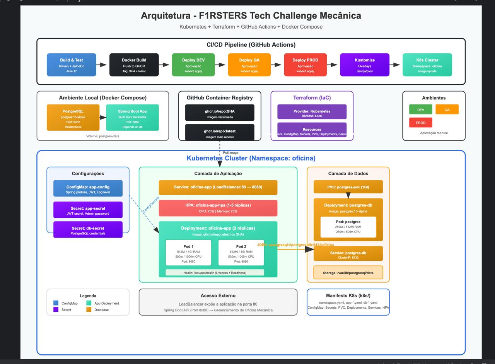

# Tech Challenge FIAP - Sistema de Gestao de Oficina Mecanica

API REST para gestao de uma oficina mecanica de medio porte, especializada em manutencao de veiculos. O sistema permite o gerenciamento completo de **clientes**, **veiculos**, **servicos**, **pecas** e **ordens de servico**, com autenticacao JWT, controle de acesso por perfis (roles) e mascaramento de dados sensiveis.

# Tech Challenge Fase 2
Descrição da Solução
Nesta segunda fase do Tech Challenge, a solução desenvolvida na Fase 2 foi evoluída para atender aos requisitos de qualidade, escalabilidade, resiliência e automação necessários para um ambiente de produção. O foco desta etapa foi modernizar a arquitetura da aplicação e sua infraestrutura, garantindo que o sistema seja capaz de suportar o crescimento da oficina mecânica, a expansão para novas unidades e o aumento no volume de ordens de serviço.
A aplicação passou por um processo de refatoração utilizando boas práticas de desenvolvimento, como Clean Code e uma arquitetura baseada em Clean Architecture (ou Arquitetura Hexagonal), promovendo melhor organização do código, separação de responsabilidades, baixo acoplamento e maior facilidade de manutenção e evolução.
Também foram implementados testes automatizados para validar os fluxos críticos da aplicação, aumentando a confiabilidade das entregas e reduzindo o risco de regressões durante futuras evoluções.
No contexto funcional, as APIs foram ampliadas para suportar o ciclo completo de gerenciamento das ordens de serviço. Entre as funcionalidades implementadas estão a abertura de ordens de serviço, consulta de status, aprovação de orçamento por integração externa, listagem das ordens conforme regras de negócio e atualização automática do status por meio de notificações.
Para garantir portabilidade e padronização do ambiente, a aplicação foi containerizada utilizando Docker, permitindo sua execução de forma consistente em diferentes ambientes de desenvolvimento e produção.
A orquestração da aplicação foi realizada com Kubernetes, utilizando manifestos para Deployments, Services, ConfigMaps, Secrets e Horizontal Pod Autoscaler (HPA), possibilitando alta disponibilidade e escalabilidade automática de acordo com a carga de utilização.
A infraestrutura foi provisionada utilizando Terraform, adotando o conceito de Infraestrutura como Código (Infrastructure as Code - IaC), tornando o ambiente reproduzível, versionado e automatizado.
Por fim, foi implementada uma pipeline de Integração Contínua e Entrega Contínua (CI/CD), responsável por automatizar o processo de build da aplicação, execução dos testes, criação da imagem Docker, provisionamento da infraestrutura, implantação do banco de dados e publicação da aplicação no cluster Kubernetes, reduzindo a intervenção manual e aumentando a confiabilidade do processo de deploy.
# Objetivos da Fase
Os principais objetivos desta fase foram:
Evoluir a aplicação desenvolvida na Fase 1 utilizando boas práticas de arquitetura e desenvolvimento de software.
Melhorar a qualidade, organização e manutenibilidade do código por meio de Clean Code e Clean Architecture.
Garantir a confiabilidade da aplicação através da implementação de testes automatizados.
Expandir as funcionalidades da API para atender ao fluxo completo de gerenciamento das ordens de serviço.
Containerizar a aplicação utilizando Docker para padronizar sua execução.
Implantar a aplicação em um ambiente orquestrado com Kubernetes, garantindo alta disponibilidade e escalabilidade automática.
Automatizar o provisionamento da infraestrutura utilizando Terraform.
Implementar um pipeline de CI/CD para automatizar o processo de integração, testes e implantação da aplicação.
Preparar o sistema para suportar crescimento, novas unidades da oficina e maior volume de requisições com segurança, disponibilidade e eficiência.
---

## Indice

- [Tecnologias Utilizadas](#tecnologias-utilizadas)
- [Arquitetura do Projeto](#arquitetura-do-projeto)
- [Diagrama de Arquitetura](#diagrama-de-arquitetura)
- [Estrutura de Pastas](#estrutura-de-pastas)
- [Pre-requisitos](#pre-requisitos)
- [Configuracao e Execucao](#configuracao-e-execucao)
    - [Opcao 1 - Docker Compose (Recomendado)](#opcao-1---docker-compose-recomendado)
    - [Opcao 2 - Execucao Local (sem Docker)](#opcao-2---execucao-local-sem-docker)
    - [Opcao 3 - Kubernetes](#opcao-3---kubernetes)
    - [Opcao 4 - Terraform (Infraestrutura como Codigo)](#opcao-4---terraform-infraestrutura-como-codigo)
- [Opcao 5 - AWS (Lambda, API Gateway, RDS)](#opcao-5---aws-lambda-api-gateway-rds)
- [Variaveis de Ambiente](#variaveis-de-ambiente)
- [Autenticacao e Seguranca](#autenticacao-e-seguranca)
    - [Perfis de Acesso (Roles)](#perfis-de-acesso-roles)
    - [Fluxo de Autenticacao JWT](#fluxo-de-autenticacao-jwt)
- [Endpoints da API](#endpoints-da-api)
    - [Autenticacao](#autenticacao)
    - [Clientes](#clientes)
    - [Veiculos](#veiculos)
    - [Servicos](#servicos)
    - [Pecas](#pecas)
    - [Ordens de Servico](#ordens-de-servico)
    - [Consulta Publica de Ordem de Servico](#consulta-publica-de-ordem-de-servico)
- [Exemplos de Requisicoes (cURL)](#exemplos-de-requisicoes-curl)
- [Swagger / OpenAPI](#swagger--openapi)
- [Postman Collection](#postman-collection)
- [Modelo de Dominio](#modelo-de-dominio)
- [Validacoes Customizadas](#validacoes-customizadas)
- [Mascaramento de Dados Sensiveis](#mascaramento-de-dados-sensiveis)
- [Testes](#testes)
    - [Estrutura de Testes](#estrutura-de-testes)
    - [Executar Testes](#executar-todos-os-testes)
    - [Tecnologias de Teste](#tecnologias-de-teste)
    - [Configuracao de Testes](#configuracao-de-testes)
    - [Cobertura de Codigo Atual](#cobertura-de-codigo-atual)
    - [Estrategia de Testes](#estrategia-de-testes)
- [Cobertura de Codigo (JaCoCo)](#cobertura-de-codigo-jacoco)

---

## Tecnologias Utilizadas

| Tecnologia | Versao | Descricao |
|---|---|---|
| **Java** | 17 | Linguagem principal |
| **Spring Boot** | 4.0.5 | Framework para construcao da API REST |
| **Spring Security** | - | Autenticacao e autorizacao |
| **Spring Data JPA** | - | Persistencia de dados com Hibernate |
| **Spring Boot Actuator** | - | Health checks e monitoramento |
| **PostgreSQL** | 15 | Banco de dados em producao |
| **H2 Database** | - | Banco de dados em memoria para testes |
| **JWT (jjwt)** | 0.12.7 | Tokens de autenticacao |
| **Lombok** | - | Reducao de boilerplate no codigo |
| **SpringDoc OpenAPI** | 3.0.2 | Documentacao Swagger/OpenAPI |
| **JaCoCo** | 0.8.12 | Cobertura de testes |
| **Maven** | - | Gerenciamento de dependencias e build |
| **Docker / Docker Compose** | - | Containerizacao da aplicacao |
| **Kubernetes** | - | Orquestracao de containers |
| **Terraform** | >= 1.0 | Infraestrutura como codigo |
| **AWS Lambda** | - | Funcoes serverless para autenticacao |
| **AWS API Gateway** | - | Gateway de API para Lambda |
| **AWS RDS** | PostgreSQL 15 | Banco de dados gerenciado |
| **Bean Validation** | - | Validacoes customizadas (CPF/CNPJ, Placa) |

---

## Arquitetura do Projeto

O projeto segue a arquitetura em camadas (Layered Architecture):

```
Controller (REST)  -->  Service (Regras de Negocio)  -->  Repository (JPA)  -->  Database
     |                       |
     v                       v
    DTO                   Domain (Entidades)
```

- **Controller**: Recebe as requisicoes HTTP e delega para os services.
- **Service**: Contem a logica de negocio (criacao de OS, controle de estoque, validacoes).
- **Repository**: Interface JPA para acesso ao banco de dados.
- **Domain**: Entidades JPA mapeadas para tabelas do banco.
- **DTO**: Objetos de transferencia para entrada e saida de dados.
- **Security**: Filtro JWT, configuracao de seguranca, servico de autenticacao.
- **Validation**: Validadores customizados para CPF/CNPJ e Placa.
- **Mapper**: Conversao de entidades para DTOs de resposta (com mascaramento de dados).
- **Exception**: Tratamento global de excecoes da API.
- **Util**: Classes utilitarias para normalizacao de input, validacao e mascaramento.

---

## Diagrama de Arquitetura



O diagrama acima representa a arquitetura completa da solução, incluindo CI/CD, ambientes de desenvolvimento e produção, e a estrutura do cluster Kubernetes. Abaixo, uma explicação detalhada de cada camada:

### Camada CI/CD Pipeline (GitHub Actions)
- **Build & Test**: Compilação do projeto com Maven, execução de testes unitários e integração, e geração de relatório de cobertura com JaCoCo (Java 17).
- **Docker Build**: Criação da imagem Docker e push para o GitHub Container Registry (GHCR) com tags SHA e latest.
- **Deploy DEV/QA/PROD**: Deploy automatizado para os ambientes de desenvolvimento, QA e produção, cada um requerendo aprovação manual.
- **Kustomize**: Gerenciamento de manifests Kubernetes com overlays para diferentes ambientes (dev, qa, prod).
- **K8s Cluster**: Aplicação dos manifests no cluster Kubernetes, atualizando a imagem da aplicação.

### Ambiente Local (Docker Compose)
- **PostgreSQL**: Banco de dados PostgreSQL 15 em container Alpine, porta 5432, com healthcheck e volume persistente.
- **Spring Boot App**: Aplicação Spring Boot construída a partir do Dockerfile, porta 8080, dependente do banco de dados.
- **Volume postgres-data**: Persistência dos dados do PostgreSQL localmente.

### GitHub Container Registry (GHCR)
- **ghcr.io/repo:SHA**: Imagem versionada com o SHA do commit, garantindo rastreabilidade.
- **ghcr.io/repo:latest**: Imagem mais recente, usada para deployments automáticos.

### Terraform (Infraestrutura como Código)
- **Provider Kubernetes**: Provedor Terraform para gerenciar recursos Kubernetes.
- **Backend Local**: Armazenamento do estado do Terraform localmente.
- **Resources**: Namespace, ConfigMap, Secrets, PVC, Deployments, Services e HPA provisionados automaticamente.

### Kubernetes Cluster (Namespace: oficina)

#### Camada de Configurações
- **ConfigMap (app-config)**: Configurações não sensíveis como profiles do Spring, parâmetros JWT e nível de log.
- **Secret (app-secret)**: Dados sensíveis da aplicação como JWT secret e senha do admin.
- **Secret (db-secret)**: Credenciais do PostgreSQL (usuário e senha).

#### Camada de Aplicação
- **Service (oficina-app)**: LoadBalancer que expõe a aplicação na porta 80, redirecionando para a porta 8080 dos pods.
- **HPA (oficina-app-hpa)**: Horizontal Pod Autoscaler configurado para escalar de 1 a 5 réplicas baseado em CPU (70%) e memória (75%).
- **Deployment (oficina-app)**: Gerencia 2 réplicas da aplicação, usando imagem do GHCR (latest ou SHA).
- **Pods**: Containers da aplicação com recursos limitados (512Mi/1Gi RAM, 500m/1000m CPU), porta 8080.
- **Health Checks**: Endpoints `/actuator/health` para liveness e readiness probes.

#### Camada de Dados
- **PVC (postgres-pvc)**: PersistentVolumeClaim com 1Gi para armazenamento persistente do PostgreSQL.
- **Deployment (postgres-db)**: Gerencia o pod do PostgreSQL com imagem postgres:15-alpine.
- **Pod (postgres)**: Container do banco com recursos (256Mi/512Mi RAM, 250m/500m CPU).
- **Service (postgres-db)**: ClusterIP expõe o banco na porta 5432 internamente.
- **Storage**: Volume montado em `/var/lib/postgresql/data` para persistência dos dados.

#### Conexões
- **Config/Secrets → App**: ConfigMap e Secrets injetados nos pods da aplicação.
- **App → Database**: Conexão JDBC via `postgresql://postgres-db:5432/oficina`.
- **GHCR → K8s**: Pull automático da imagem do registry pelo cluster.
- **PVC → PostgreSQL**: Volume persistente anexado ao pod do banco.

#### Acesso Externo
- **LoadBalancer**: Expõe a aplicação na porta 80 para acesso externo.
- **Spring Boot API**: API REST na porta 8080 para gerenciamento da oficina mecânica.

#### Manifests K8s (k8s/)
- Arquivos YAML para provisionamento de todos os recursos: namespace, ConfigMap, Secrets, PVC, Deployments, Services e HPA.

#### Ambientes
- **DEV**: Ambiente de desenvolvimento (deploy automático).
- **QA**: Ambiente de testes (requer aprovação manual).
- **PROD**: Ambiente de produção (requer aprovação manual).

---

## Estrutura de Pastas

```
f1rsters-tech-challenge-mecanica/
├── src/
│   ├── main/
│   │   ├── java/com/f1rsters/tech_challenge_mecanica/
│   │   │   ├── TechChallengeMecanicaApplication.java  # Classe principal
│   │   │   ├── config/
│   │   │   │   ├── SecurityConfig.java                # Configuracao Spring Security
│   │   │   │   ├── SecuritySeedConfig.java            # Seed do usuario admin
│   │   │   │   └── OpenApiConfig.java                 # Configuracao Swagger/OpenAPI
│   │   │   ├── controller/
│   │   │   │   ├── AuthController.java                # Login / Autenticacao
│   │   │   │   ├── ClienteController.java             # CRUD de Clientes
│   │   │   │   ├── VeiculoController.java             # CRUD de Veiculos
│   │   │   │   ├── ServicoController.java             # CRUD de Servicos
│   │   │   │   ├── PecaController.java                # CRUD de Pecas + Estoque
│   │   │   │   ├── OrdemServicoController.java        # Ordens de Servico (admin)
│   │   │   │   └── OrdemServicoPublicController.java  # Consulta publica de OS
│   │   │   ├── domain/
│   │   │   │   ├── Cliente.java                       # Entidade Cliente
│   │   │   │   ├── Veiculo.java                       # Entidade Veiculo
│   │   │   │   ├── Servico.java                       # Entidade Servico
│   │   │   │   ├── Peca.java                          # Entidade Peca
│   │   │   │   ├── OrdemServico.java                  # Entidade Ordem de Servico
│   │   │   │   ├── Usuario.java                       # Entidade Usuario
│   │   │   │   ├── Role.java                          # Enum de perfis
│   │   │   │   └── StatusOrdemServico.java            # Enum de status da OS
│   │   │   ├── dto/
│   │   │   │   ├── LoginRequestDTO.java               # Requisicao de login
│   │   │   │   ├── LoginResponseDTO.java              # Resposta de login (token)
│   │   │   │   ├── ClienteDTO.java                    # Entrada de dados de cliente
│   │   │   │   ├── ClienteResponseDTO.java            # Resposta com CPF mascarado
│   │   │   │   ├── VeiculoDTO.java                    # Entrada de dados de veiculo
│   │   │   │   ├── VeiculoResponseDTO.java            # Resposta com placa mascarada
│   │   │   │   ├── ServicoDTO.java                    # Entrada de dados de servico
│   │   │   │   ├── PecaDTO.java                       # Entrada de dados de peca
│   │   │   │   ├── BaixaEstoqueDTO.java               # Baixa de estoque
│   │   │   │   ├── CriarOrdemServicoDTO.java          # Criacao de OS
│   │   │   │   ├── AtualizarStatusOSDTO.java          # Atualizacao de status da OS
│   │   │   │   ├── OrdemServicoPublicDTO.java         # Visualizacao publica da OS
│   │   │   │   ├── NotificacaoStatusDTO.java          # DTO de notificacao de status
│   │   │   │   ├── RespostaOrcamentoDTO.java          # DTO de resposta de orcamento
│   │   │   │   └── StatusOrdemServicoDTO.java        # DTO de status da OS
│   │   │   ├── exception/
│   │   │   │   └── ApiExceptionHandler.java           # Handler global de excecoes
│   │   │   ├── mapper/
│   │   │   │   ├── ClienteMapper.java                 # Mapper Cliente -> ResponseDTO
│   │   │   │   └── VeiculoMapper.java                 # Mapper Veiculo -> ResponseDTO
│   │   │   ├── repository/
│   │   │   │   ├── ClienteRepository.java
│   │   │   │   ├── VeiculoRepository.java
│   │   │   │   ├── ServicoRepository.java
│   │   │   │   ├── PecaRepository.java
│   │   │   │   ├── OrdemServicoRepository.java
│   │   │   │   └── UsuarioRepository.java
│   │   │   ├── security/
│   │   │   │   ├── JwtService.java                    # Geracao e validacao de JWT
│   │   │   │   ├── JwtAuthenticationFilter.java       # Filtro de autenticacao
│   │   │   │   ├── CustomUserDetailsService.java      # Carregamento de usuarios
│   │   │   │   ├── AuthEntryPoint.java                # Handler de erros 401
│   │   │   │   └── AccessDeniedHandlerImpl.java       # Handler de erros 403
│   │   │   ├── service/
│   │   │   │   ├── ClienteService.java
│   │   │   │   ├── VeiculoService.java
│   │   │   │   ├── ServicoService.java
│   │   │   │   ├── PecaService.java
│   │   │   │   └── OrdemServicoService.java
│   │   │   ├── util/
│   │   │   │   ├── InputNormalizer.java               # Normalizacao de CPF, placa, email
│   │   │   │   ├── CpfCnpjValidator.java              # Validacao de CPF/CNPJ
│   │   │   │   ├── PlacaValidator.java                # Validacao de placa BR/Mercosul
│   │   │   │   └── SensitiveDataMasker.java           # Mascaramento de dados
│   │   │   └── validation/
│   │   │       ├── CpfCnpjValido.java                 # Anotacao @CpfCnpjValido
│   │   │       ├── CpfCnpjConstraintValidator.java    # Implementacao do validador
│   │   │       ├── PlacaValida.java                   # Anotacao @PlacaValida
│   │   │       └── PlacaConstraintValidator.java      # Implementacao do validador
│   │   └── resources/
│   │       └── application.yaml                       # Configuracao principal
│   └── test/
│       ├── java/com/f1rsters/tech_challenge_mecanica/ # Testes unitarios e de integracao
│       └── resources/
│           └── application-test.yaml                  # Configuracao para testes (H2)
├── k8s/                                               # Manifestos Kubernetes
│   ├── namespace.yaml                                 # Namespace da aplicacao
│   ├── app-configmap.yaml                              # ConfigMap da aplicacao
│   ├── app-secret.yaml                                 # Secret da aplicacao (JWT)
│   ├── app-deployment.yaml                             # Deployment da aplicacao
│   ├── app-service.yaml                               # Service da aplicacao (NodePort)
│   ├── app-hpa.yaml                                   # Horizontal Pod Autoscaler
│   ├── db-secret.yaml                                 # Secret do banco de dados
│   ├── db-deployment.yaml                             # Deployment do PostgreSQL
│   ├── db-service.yaml                               # Service do PostgreSQL
│   └── db-pvc.yaml                                    # PersistentVolumeClaim para PostgreSQL
├── infra/                                             # Infraestrutura como codigo (Terraform)
│   ├── main.tf                                        # Configuracao principal Terraform
│   ├── variables.tf                                   # Variaveis Terraform
│   ├── outputs.tf                                     # Outputs Terraform
│   └── README.md                                      # Documentacao da infraestrutura
├── aws/                                               # Recursos AWS (Lambda, API Gateway, RDS)
│   ├── lambda/                                        # Funcoes Lambda
│   │   ├── auth-function/                             # Lambda de autenticacao
│   │   │   ├── src/main/java/com/f1rsters/tech_challenge_mecanica/lambda/
│   │   │   │   ├── AuthHandler.java                   # Handler da Lambda
│   │   │   │   ├── JwtService.java                    # Servico JWT
│   │   │   │   ├── DatabaseService.java               # Servico de banco de dados
│   │   │   │   ├── CpfValidator.java                  # Validador de CPF
│   │   │   │   └── ClientInfo.java                    # Informacoes do cliente
│   │   │   ├── pom.xml                                 # Dependencias Maven
│   │   │   └── README.md                              # Documentacao da Lambda
│   │   └── common/                                    # Codigo compartilhado entre Lambdas
│   ├── terraform/                                     # Infraestrutura AWS com Terraform
│   │   ├── main.tf                                    # Configuracao principal
│   │   ├── variables.tf                               # Variaveis
│   │   ├── outputs.tf                                 # Outputs
│   │   ├── terraform.tfvars.example                   # Exemplo de variaveis
│   │   ├── terraform.tfvars.dev                       # Variaveis dev
│   │   ├── terraform.tfvars.homolog                   # Variaveis homolog
│   │   └── terraform.tfvars.prod                      # Variaveis prod
│   └── ARCHITECTURE.md                                # Documentacao da arquitetura AWS
├── docs/                                              # Documentacao adicional
│   ├── api-testing-guide.md                           # Guia de testes da API
│   ├── authentication-sequence-diagram.md            # Diagrama de sequencia de autenticacao
│   └── rfc-authentication-strategy.md                 # RFC da estrategia de autenticacao
├── Dockerfile                                         # Imagem Docker da aplicacao (multi-stage)
├── docker-compose.yml                                 # Orquestracao (PostgreSQL + App)
├── TechChallengeMecanica.postman_collection.json      # Colecao Postman pronta
├── pom.xml                                            # Dependencias Maven
├── mvnw / mvnw.cmd                                    # Maven Wrapper
└── README.md
```

---

## Pre-requisitos

### Para execucao com Docker (Recomendado)
- [Docker](https://docs.docker.com/get-docker/) (versao 20+)
- [Docker Compose](https://docs.docker.com/compose/install/) (versao 2+)

### Para execucao local (sem Docker)
- [Java JDK 17](https://adoptium.net/) (Eclipse Temurin recomendado)
- [Maven 3.8+](https://maven.apache.org/download.cgi) (ou use o Maven Wrapper incluso: `./mvnw`)
- [PostgreSQL 15](https://www.postgresql.org/download/)
- [Git](https://git-scm.com/downloads)

### Para Kubernetes
- [kubectl](https://kubernetes.io/docs/tasks/tools/) - CLI do Kubernetes
- Cluster Kubernetes local (Kind, Minikube ou K3d)

### Para Terraform
- [Terraform](https://developer.hashicorp.com/terraform/downloads) >= 1.0
- Cluster Kubernetes local (Kind, Minikube ou K3d)

### Ferramentas opcionais
- [Postman](https://www.postman.com/downloads/) - Para testar os endpoints (colecao inclusa)
- [cURL](https://curl.se/) - Para testar via terminal

---

## Configuracao e Execucao

### Opcao 1 - Docker Compose (Recomendado)

Esta e a forma mais simples de executar o projeto. O Docker Compose sobe o banco PostgreSQL e a aplicacao automaticamente.

**1. Clone o repositorio:**

```bash
git clone https://github.com/diogocarpio/f1rsters-tech-challenge-mecanica.git
cd f1rsters-tech-challenge-mecanica
git checkout feature/diogo
```

**2. Suba os containers:**

```bash
docker-compose up --build -d
```

> **Nota:** O Dockerfile utiliza multi-stage build e faz o build Maven automaticamente durante o processo de build da imagem.

Isso ira:
- Subir um container PostgreSQL 15 na porta `5432`
- Subir a aplicacao Spring Boot na porta `8080`
- Criar automaticamente um usuario admin (seed)

**3. Verifique se os containers estao rodando:**

```bash
docker-compose ps
```

**4. Acesse a API:**
- API: `http://localhost:8080`
- Swagger UI: `http://localhost:8080/swagger-ui/index.html`

**5. Para parar os containers:**

```bash
docker-compose down
```

**6. Para parar e remover os dados do banco:**

```bash
docker-compose down -v
```

---

### Opcao 2 - Execucao Local (sem Docker)

**1. Clone o repositorio:**

```bash
git clone https://github.com/diogocarpio/f1rsters-tech-challenge-mecanica.git
cd f1rsters-tech-challenge-mecanica
git checkout feature/diogo
```

**2. Configure o PostgreSQL:**

Crie o banco de dados e o usuario no PostgreSQL:

```sql
CREATE DATABASE oficina;
CREATE USER oficinauser WITH PASSWORD 'oficinapassword';
GRANT ALL PRIVILEGES ON DATABASE oficina TO oficinauser;
```

> Caso ja tenha o PostgreSQL instalado e prefira usar outro usuario/senha, altere o arquivo `src/main/resources/application.yaml` ou defina variaveis de ambiente.

**3. Execute a aplicacao:**

```bash
# Linux / macOS
./mvnw spring-boot:run

# Windows
mvnw.cmd spring-boot:run
```

A aplicacao ira iniciar na porta `8080` e o Hibernate criara as tabelas automaticamente (`ddl-auto: update`).

**4. Acesse a API:**
- API: `http://localhost:8080`
- Swagger UI: `http://localhost:8080/swagger-ui/index.html`

---

### Opcao 3 - Kubernetes

Para executar a aplicacao em um cluster Kubernetes local (Kind, Minikube ou K3d).

**1. Build da imagem Docker:**

```bash
docker build -t oficina-app:latest .
```

**2. Carregar a imagem no cluster (se usando Kind):**

```bash
kind load docker-image oficina-app:latest
```

**3. Aplicar os manifestos Kubernetes:**

```bash
kubectl apply -f k8s/namespace.yaml
kubectl apply -f k8s/app-configmap.yaml
kubectl apply -f k8s/app-secret.yaml
kubectl apply -f k8s/db-secret.yaml
kubectl apply -f k8s/db-pvc.yaml
kubectl apply -f k8s/db-deployment.yaml
kubectl apply -f k8s/db-service.yaml
kubectl apply -f k8s/app-deployment.yaml
kubectl apply -f k8s/app-service.yaml
kubectl apply -f k8s/app-hpa.yaml
```

**4. Verificar os recursos:**

```bash
kubectl get pods -n oficina
kubectl get svc -n oficina
kubectl get hpa -n oficina
```

**5. Acessar a aplicacao:**

```bash
# Obter a porta do NodePort
kubectl get svc oficina-app -n oficina

# Acessar via NodePort
http://localhost:<NODEPORT>
```

**6. Remover os recursos:**

```bash
kubectl delete -f k8s/
```

---

### Opcao 4 - Terraform (Infraestrutura como Codigo)

Para provisionar a infraestrutura Kubernetes usando Terraform.

> Antes do `terraform apply`, garanta que a imagem `oficina-app:latest` exista no cluster local.
> O Terraform expõe `postgres_storage_class_name` para ajustar a StorageClass do PVC do Postgres; em kind com Docker Desktop, `standard` costuma funcionar.

**1. Inicializar o Terraform:**

```bash
cd infra
terraform init
```

**2. Validar a configuracao:**

```bash
terraform validate
```

**3. Planejar as mudancas:**

```bash
terraform plan
```

**4. Aplicar a infraestrutura:**

```bash
terraform apply
```

**5. Verificar os recursos criados:**

```bash
kubectl get pods -n oficina
kubectl get svc -n oficina
kubectl get hpa -n oficina
```

**6. Destruir a infraestrutura:**

```bash
terraform destroy
```

Para mais detalhes, consulte o `infra/README.md`.

---

### Opcao 5 - AWS (Lambda, API Gateway, RDS)

Para executar a aplicacao usando AWS Lambda, API Gateway e RDS PostgreSQL (Tech Challenge Parte 1).

**Pre-requisitos AWS:**
- Conta AWS com credenciais configuradas
- AWS CLI instalado e configurado
- Terraform instalado
- Buckets S3 criados para Terraform state e Lambda artifacts

**1. Configurar credenciais AWS:**

```bash
# Configure suas credenciais AWS
aws configure
```

Ou use o arquivo de exemplo:
```bash
cp .env.example .env
# Edite o arquivo .env com suas credenciais
```

**2. Criar buckets S3 necessarios:**

```bash
# Bucket para estado do Terraform
aws s3 mb s3://f1rsters-tech-challenge-terraform-state --region sa-east-1

# Bucket para artifacts da Lambda
aws s3 mb s3://f1rsters-tech-challenge-lambda-artifacts --region sa-east-1

# Criar tabela DynamoDB para locks do Terraform
aws dynamodb create-table \
  --table-name terraform-locks \
  --attribute-definitions AttributeName=LockID,AttributeType=S \
  --key-schema AttributeName=LockID,KeyType=HASH \
  --billing-mode PAY_PER_REQUEST \
  --region sa-east-1
```

**3. Configurar variaveis do Terraform:**

```bash
cd aws/terraform
cp terraform.tfvars.example terraform.tfvars
# Edite terraform.tfvars com suas configuracoes (VPC, subnets, etc.)
```

**4. Inicializar e aplicar Terraform:**

```bash
cd aws/terraform
terraform init \
  -backend-config="bucket=f1rsters-tech-challenge-terraform-state" \
  -backend-config="key=tech-challenge-mecanica/terraform.tfstate" \
  -backend-config="region=sa-east-1" \
  -backend-config="encrypt=true"

terraform plan
terraform apply
```

**5. Build e deploy da Lambda Function:**

```bash
cd aws/lambda/auth-function
mvn clean package

# Upload para S3
aws s3 cp target/auth-function.jar s3://f1rsters-tech-challenge-lambda-artifacts/auth-function.jar

# Atualizar Lambda
aws lambda update-function-code \
  --function-name f1rsters-tech-challenge-mecanica-auth-function \
  --s3-bucket f1rsters-tech-challenge-lambda-artifacts \
  --s3-key auth-function.jar
```

**6. Testar a API:**

```bash
# Obter o endpoint do API Gateway
aws apigatewayv2 get-stage \
  --api-id $(terraform output -raw api_id) \
  --stage-name dev

# Testar autenticacao
curl -X POST https://<api-gateway-endpoint>/dev/auth/login \
  -H "Content-Type: application/json" \
  -d '{"cpf": "12345678909"}'
```

**7. Destruir recursos AWS:**

```bash
cd aws/terraform
terraform destroy
```

Para mais detalhes sobre a Lambda Function, consulte `aws/lambda/auth-function/README.md`.

---

## Variaveis de Ambiente

A aplicacao utiliza variaveis de ambiente com valores padrao. Em producao, e **obrigatorio** redefinir os valores sensiveis:

| Variavel | Descricao | Valor Padrao |
|---|---|---|
| `JWT_SECRET_BASE64` | Chave secreta Base64 para assinatura JWT (min. 256 bits) | `QUJDREVGR0hJSktMTU5PUFFSU1RVVldYWVo0NTY3ODkwQUJDREVG` |
| `JWT_ACCESS_TOKEN_MINUTES` | Tempo de expiracao do token JWT (minutos) | `15` |
| `JWT_ISSUER` | Emissor do token JWT | `tech-challenge-mecanica-api` |
| `SECURITY_SEED_ENABLED` | Habilita criacao automatica do usuario admin | `true` |
| `SECURITY_SEED_ADMIN_EMAIL` | Email do usuario admin seed | `admin@oficina.local` |
| `SECURITY_SEED_ADMIN_PASSWORD` | Senha do usuario admin seed | `admin123` |
| `SPRING_PROFILES_ACTIVE` | Perfil ativo do Spring | (nenhum / `prod`) |

> **Importante:** Na primeira execucao com `SECURITY_SEED_ENABLED=true`, o sistema cria automaticamente um usuario administrador com as credenciais configuradas. Apos o primeiro login, voce pode desabilitar o seed.

---

## Autenticacao e Seguranca

### Perfis de Acesso (Roles)

O sistema possui 4 perfis de acesso com permissoes diferenciadas:

| Role | Permissoes |
|---|---|
| **ADMIN** | Acesso total a todos os endpoints |
| **ATENDENTE** | CRUD de Clientes, Veiculos, Servicos; Criar e listar Ordens de Servico |
| **MECANICO** | Atualizar status de OS; Consultar pecas e estoque; Baixar estoque; Criar e listar OS |
| **ESTOQUISTA** | CRUD de Pecas; Consultar e baixar estoque |

### Permissoes por Endpoint

| Metodo | Endpoint | Roles Permitidas |
|---|---|---|
| `POST` | `/api/auth/login` | Publico (sem autenticacao) |
| `GET` | `/api/public/ordens-servico/{id}` | Publico (sem autenticacao) |
| `POST/PUT/DELETE` | `/api/admin/clientes/**` | ADMIN, ATENDENTE |
| `GET` | `/api/admin/clientes/**` | ADMIN, ATENDENTE |
| `POST/PUT/DELETE` | `/api/admin/veiculos/**` | ADMIN, ATENDENTE |
| `GET` | `/api/admin/veiculos/**` | ADMIN, ATENDENTE |
| `POST/PUT/DELETE` | `/api/admin/servicos/**` | ADMIN, ATENDENTE |
| `GET` | `/api/admin/servicos/**` | ADMIN, ATENDENTE |
| `POST` | `/api/admin/pecas` | ADMIN, ESTOQUISTA |
| `PUT/DELETE` | `/api/admin/pecas/**` | ADMIN, ESTOQUISTA |
| `GET` | `/api/admin/pecas/**` | ADMIN, ESTOQUISTA, MECANICO |
| `POST` | `/api/admin/pecas/baixa` | ADMIN, ESTOQUISTA, MECANICO |
| `POST` | `/api/admin/ordens-servico` | ADMIN, ATENDENTE, MECANICO |
| `GET` | `/api/admin/ordens-servico/**` | ADMIN, ATENDENTE, MECANICO |
| `PATCH` | `/api/admin/ordens-servico/{id}/status` | ADMIN, MECANICO |

### Fluxo de Autenticacao JWT

```
1. Cliente faz POST /api/auth/login com email e senha
2. Servidor valida credenciais e retorna um token JWT
3. Cliente envia o token no header Authorization: Bearer <token>
4. Filtro JwtAuthenticationFilter intercepta a requisicao e valida o token
5. Se valido, o usuario e autenticado e a requisicao prossegue
6. Se invalido/expirado, retorna 401 Unauthorized
```

O token JWT contem:
- **subject**: email do usuario
- **roles**: lista de perfis (ex: `["ROLE_ADMIN"]`)
- **issuer**: nome do emissor da API
- **expiracao**: configuravel (padrao 15 minutos)

---

## Endpoints da API

### Autenticacao

#### `POST /api/auth/login`
Realiza login e retorna um token JWT.

**Request Body:**
```json
{
  "email": "admin@oficina.local",
  "senha": "admin123"
}
```

**Response (200 OK):**
```json
{
  "accessToken": "eyJhbGciOiJIUzI1NiJ9...",
  "tokenType": "Bearer",
  "expiresInSeconds": 900,
  "roles": ["ROLE_ADMIN"]
}
```

---

### Clientes

> **Autenticacao necessaria.** Envie o header: `Authorization: Bearer <token>`

#### `POST /api/admin/clientes` - Criar cliente

**Request Body:**
```json
{
  "nome": "Cliente Exemplo",
  "cpfCnpj": "12345678901"
}
```

**Response (200 OK):**
```json
{
  "id": 1,
  "nome": "Cliente Exemplo",
  "cpfCnpjMascarado": "***.45.***-01"
}
```

**Response (400 BAD_REQUEST):**
```json
{
  "status": 400,
  "error": "VALIDATION_ERROR",
  "fields": [
    {
      "field": "cpfCnpj",
      "message": "CPF/CNPJ inválido"
    }
  ]
}
```

#### `GET /api/admin/clientes` - Listar todos os clientes

**Response (200 OK):**
```json
[
  {
    "id": 1,
    "nome": "Cliente Exemplo",
    "cpfCnpjMascarado": "***.45.***-01"
  }
]
```

#### `GET /api/admin/clientes/{id}` - Buscar cliente por ID

**Response (200 OK):**
```json
{
  "id": 1,
  "nome": "Cliente Exemplo",
  "cpfCnpjMascarado": "***.45.***-01"
}
```

**Response (404 NOT_FOUND):**
```json
{
  "status": 404,
  "error": "NOT_FOUND",
  "message": "Cliente não encontrado"
}
```

#### `PUT /api/admin/clientes/{id}` - Atualizar cliente

**Request Body:**
```json
{
  "nome": "Cliente Atualizado",
  "cpfCnpj": "12345678901"
}
```

**Response (200 OK):**
```json
{
  "id": 1,
  "nome": "Cliente Atualizado",
  "cpfCnpjMascarado": "***.45.***-01"
}
```

#### `DELETE /api/admin/clientes/{id}` - Remover cliente

**Response (204 NO_CONTENT):** (sem corpo)

> **Nota:** O CPF/CNPJ e validado com o algoritmo oficial (digitos verificadores). O campo `cpfCnpj` aceita tanto CPF (11 digitos) quanto CNPJ (14 digitos), com ou sem formatacao (pontos, tracos, barras sao removidos automaticamente). Na resposta, o CPF/CNPJ e retornado mascarado (ex: `***.45.***-01`).

---

### Veiculos

> **Autenticacao necessaria.** Envie o header: `Authorization: Bearer <token>`

#### `POST /api/admin/veiculos` - Cadastrar veiculo

**Request Body:**
```json
{
  "clienteId": 1,
  "placa": "ABC1D23",
  "marca": "Toyota",
  "modelo": "Corolla",
  "ano": 2020
}
```

**Response (200 OK):**
```json
{
  "id": 1,
  "clienteId": 1,
  "placaMascarada": "ABC****",
  "marca": "Toyota",
  "modelo": "Corolla",
  "ano": 2020
}
```

**Response (400 BAD_REQUEST):**
```json
{
  "status": 400,
  "error": "VALIDATION_ERROR",
  "fields": [
    {
      "field": "placa",
      "message": "Placa inválida"
    }
  ]
}
```

#### `GET /api/admin/veiculos` - Listar todos os veiculos

**Response (200 OK):**
```json
[
  {
    "id": 1,
    "clienteId": 1,
    "placaMascarada": "ABC****",
    "marca": "Toyota",
    "modelo": "Corolla",
    "ano": 2020
  }
]
```

#### `GET /api/admin/veiculos/{id}` - Buscar veiculo por ID

**Response (200 OK):**
```json
{
  "id": 1,
  "clienteId": 1,
  "placaMascarada": "ABC****",
  "marca": "Toyota",
  "modelo": "Corolla",
  "ano": 2020
}
```

#### `PUT /api/admin/veiculos/{id}` - Atualizar veiculo

**Request Body:**
```json
{
  "clienteId": 1,
  "placa": "ABC1D23",
  "marca": "Toyota",
  "modelo": "Corolla XEi",
  "ano": 2021
}
```

**Response (200 OK):**
```json
{
  "id": 1,
  "clienteId": 1,
  "placaMascarada": "ABC****",
  "marca": "Toyota",
  "modelo": "Corolla XEi",
  "ano": 2021
}
```

#### `DELETE /api/admin/veiculos/{id}` - Remover veiculo

**Response (204 NO_CONTENT):** (sem corpo)

> **Nota:** A placa aceita o formato brasileiro antigo (`ABC1234`) e o formato Mercosul (`ABC1D23`). Caracteres especiais (tracos, espacos) sao removidos automaticamente. Na resposta, a placa e mascarada (ex: `ABC****`).

---

### Servicos

> **Autenticacao necessaria.** Envie o header: `Authorization: Bearer <token>`

#### `POST /api/admin/servicos` - Cadastrar servico

**Request Body:**
```json
{
  "descricao": "Troca de oleo",
  "valor": 150.00
}
```

**Response (200 OK):**
```json
{
  "id": 1,
  "descricao": "Troca de oleo",
  "valor": 150.00
}
```

**Response (400 BAD_REQUEST):**
```json
{
  "status": 400,
  "error": "VALIDATION_ERROR",
  "fields": [
    {
      "field": "descricao",
      "message": "Descrição é obrigatória"
    }
  ]
}
```

#### `GET /api/admin/servicos` - Listar todos os servicos

**Response (200 OK):**
```json
[
  {
    "id": 1,
    "descricao": "Troca de oleo",
    "valor": 150.00
  }
]
```

#### `GET /api/admin/servicos/{id}` - Buscar servico por ID

**Response (200 OK):**
```json
{
  "id": 1,
  "descricao": "Troca de oleo",
  "valor": 150.00
}
```

#### `PUT /api/admin/servicos/{id}` - Atualizar servico

**Request Body:**
```json
{
  "descricao": "Alinhamento e Balanceamento",
  "valor": 200.00
}
```

**Response (200 OK):**
```json
{
  "id": 1,
  "descricao": "Alinhamento e Balanceamento",
  "valor": 200.00
}
```

#### `DELETE /api/admin/servicos/{id}` - Remover servico

**Response (204 NO_CONTENT):** (sem corpo)

---

### Pecas

> **Autenticacao necessaria.** Envie o header: `Authorization: Bearer <token>`

#### `POST /api/admin/pecas` - Cadastrar peca

**Request Body:**
```json
{
  "descricao": "Filtro de oleo",
  "quantidadeEstoque": 20,
  "valorUnitario": 35.90
}
```

**Response (200 OK):**
```json
{
  "id": 1,
  "descricao": "Filtro de oleo",
  "quantidadeEstoque": 20,
  "valorUnitario": 35.90
}
```

#### `GET /api/admin/pecas` - Listar todas as pecas

**Response (200 OK):**
```json
[
  {
    "id": 1,
    "descricao": "Filtro de oleo",
    "quantidadeEstoque": 20,
    "valorUnitario": 35.90
  }
]
```

#### `GET /api/admin/pecas/{id}` - Buscar peca por ID

**Response (200 OK):**
```json
{
  "id": 1,
  "descricao": "Filtro de oleo",
  "quantidadeEstoque": 20,
  "valorUnitario": 35.90
}
```

#### `PUT /api/admin/pecas/{id}` - Atualizar peca

**Request Body:**
```json
{
  "descricao": "Filtro de ar",
  "quantidadeEstoque": 10,
  "valorUnitario": 49.90
}
```

**Response (200 OK):**
```json
{
  "id": 1,
  "descricao": "Filtro de ar",
  "quantidadeEstoque": 10,
  "valorUnitario": 49.90
}
```

#### `DELETE /api/admin/pecas/{id}` - Remover peca

**Response (204 NO_CONTENT):** (sem corpo)

#### `GET /api/admin/pecas/estoque` - Consultar estoque de pecas

**Response (200 OK):**
```json
[
  {
    "id": 1,
    "descricao": "Filtro de oleo",
    "quantidadeEstoque": 20,
    "valorUnitario": 35.90
  }
]
```

#### `POST /api/admin/pecas/baixa` - Dar baixa no estoque

**Request Body:**
```json
{
  "pecaId": 1,
  "quantidade": 1
}
```

**Response (200 OK):**
```json
{
  "id": 1,
  "descricao": "Filtro de oleo",
  "quantidadeEstoque": 19,
  "valorUnitario": 35.90
}
```

**Response (400 BAD_REQUEST):**
```json
{
  "status": 400,
  "error": "BUSINESS_ERROR",
  "message": "Estoque insuficiente para a peça: Filtro de oleo"
}
```

> **Nota:** A baixa de estoque desconta a quantidade informada. Se o estoque for insuficiente, retorna erro.

---

### Ordens de Servico

> **Autenticacao necessaria.** Envie o header: `Authorization: Bearer <token>`

#### `POST /api/admin/ordens-servico` - Criar ordem de servico

**Request Body:**
```json
{
  "cpfCnpjCliente": "12345678901",
  "placaVeiculo": "ABC1D23",
  "servicos": [1],
  "pecas": [1]
}
```

**Response (200 OK):**
```json
{
  "id": 1,
  "cliente": {
    "id": 1,
    "nome": "Cliente Exemplo",
    "cpfCnpj": "***.45.***-01"
  },
  "veiculo": {
    "id": 1,
    "placa": "ABC****",
    "marca": "Toyota",
    "modelo": "Corolla"
  },
  "servicos": [
    {
      "id": 1,
      "descricao": "Troca de oleo",
      "valor": 150.00
    }
  ],
  "pecas": [
    {
      "id": 1,
      "descricao": "Filtro de oleo",
      "valorUnitario": 35.90
    }
  ],
  "valorTotal": 185.90,
  "status": "RECEBIDA",
  "criadoEm": "2025-01-15T10:30:00"
}
```

**Response (400 BAD_REQUEST):**
```json
{
  "status": 400,
  "error": "BUSINESS_ERROR",
  "message": "Estoque insuficiente para a peça: Filtro de oleo"
}
```

**Logica de criacao:**
1. Busca o cliente pelo CPF/CNPJ
2. Busca o veiculo pela placa
3. Busca os servicos e pecas pelos IDs informados
4. Valida e desconta 1 unidade de cada peca do estoque
5. Calcula o valor total (soma dos servicos + soma das pecas)
6. Cria a OS com status `RECEBIDA`

#### `GET /api/admin/ordens-servico` - Listar todas as ordens de servico

**Response (200 OK):**
```json
[
  {
    "id": 1,
    "cliente": {
      "id": 1,
      "nome": "Cliente Exemplo",
      "cpfCnpj": "***.45.***-01"
    },
    "veiculo": {
      "id": 1,
      "placa": "ABC****",
      "marca": "Toyota",
      "modelo": "Corolla"
    },
    "valorTotal": 185.90,
    "status": "EM_EXECUCAO",
    "criadoEm": "2025-01-15T10:30:00"
  }
]
```

#### `GET /api/admin/ordens-servico/{id}` - Detalhar ordem de servico

**Response (200 OK):**
```json
{
  "id": 1,
  "cliente": {
    "id": 1,
    "nome": "Cliente Exemplo",
    "cpfCnpj": "***.45.***-01"
  },
  "veiculo": {
    "id": 1,
    "placa": "ABC****",
    "marca": "Toyota",
    "modelo": "Corolla"
  },
  "servicos": [
    {
      "id": 1,
      "descricao": "Troca de oleo",
      "valor": 150.00
    }
  ],
  "pecas": [
    {
      "id": 1,
      "descricao": "Filtro de oleo",
      "valorUnitario": 35.90
    }
  ],
  "valorTotal": 185.90,
  "status": "EM_EXECUCAO",
  "criadoEm": "2025-01-15T10:30:00"
}
```

#### `PATCH /api/admin/ordens-servico/{id}/status` - Atualizar status da OS

**Request Body:**
```json
{
  "novoStatus": "EM_EXECUCAO"
}
```

**Response (200 OK):**
```json
{
  "id": 1,
  "cliente": {
    "id": 1,
    "nome": "Cliente Exemplo"
  },
  "veiculo": {
    "id": 1,
    "placa": "ABC****"
  },
  "valorTotal": 185.90,
  "status": "EM_EXECUCAO",
  "criadoEm": "2025-01-15T10:30:00"
}
```

#### `GET /api/admin/ordens-servico/{id}/status` - Consultar status da OS

Retorna o status atual da ordem de servico.

**Response (200 OK):**
```json
{
  "id": 1,
  "status": "DIAGNOSTICO",
  "atualizadoEm": "2025-01-15T10:30:00"
}
```

#### `POST /api/admin/ordens-servico/{id}/orcamento/resposta` - Responder orcamento

Recebe notificacao externa de aprovacao ou recusa do orcamento.

**Request Body:**
```json
{
  "aprovado": true,
  "origem": "SISTEMA_EXTERNO",
  "observacao": "Cliente aprovou o orcamento"
}
```

**Response (200 OK):**
```json
{
  "id": 1,
  "valorTotal": 185.90,
  "status": "EM_EXECUCAO",
  "criadoEm": "2025-01-15T10:30:00"
}
```

**Logica:**
- Se `aprovado = true`: move a OS para `EM_EXECUCAO`
- Se `aprovado = false`: mantem o status atual mas registra a decisao
- Apenas aceita OS com status `AGUARDANDO_APROVACAO`

#### `POST /api/admin/ordens-servico/{id}/status/notificacao` - Atualizar status via notificacao externa

Simula ou integra recebimento de notificacao externa (ex: email) para atualizar o status da OS.

**Request Body:**
```json
{
  "novoStatus": "AGUARDANDO_APROVACAO",
  "origem": "EMAIL",
  "mensagem": "Diagnostico concluido. Aguardando aprovacao do cliente."
}
```

**Response (200 OK):**
```json
{
  "id": 1,
  "valorTotal": 185.90,
  "status": "AGUARDANDO_APROVACAO",
  "criadoEm": "2025-01-15T10:30:00"
}
```

**Status disponiveis (fluxo da OS):**

```
RECEBIDA --> DIAGNOSTICO --> AGUARDANDO_APROVACAO --> EM_EXECUCAO --> FINALIZADA --> ENTREGUE
```

| Status | Descricao |
|---|---|
| `RECEBIDA` | Veiculo recebido na oficina (status inicial) |
| `DIAGNOSTICO` | Em processo de avaliacao |
| `AGUARDANDO_APROVACAO` | Aguardando aprovacao do cliente |
| `EM_EXECUCAO` | Servico em andamento |
| `FINALIZADA` | Servico concluido |
| `ENTREGUE` | Veiculo entregue ao cliente |

**Regras de listagem:**
- A listagem principal (`GET /api/admin/ordens-servico`) retorna apenas OS ativas
- OS com status `FINALIZADA` e `ENTREGUE` sao excluidas logicamente da listagem
- A ordenacao respeita a prioridade de status: `EM_EXECUCAO` > `AGUARDANDO_APROVACAO` > `DIAGNOSTICO` > `RECEBIDA`
- Dentro do mesmo status, as OS mais antigas aparecem primeiro

---

### Consulta Publica de Ordem de Servico

#### `GET /api/public/ordens-servico/{id}`

Endpoint **publico** (nao requer autenticacao) para o cliente acompanhar o status da sua ordem de servico. Retorna dados com informacoes sensiveis mascaradas.

**Response (200 OK):**
```json
{
  "id": 1,
  "status": "EM_EXECUCAO",
  "criadoEm": "2025-01-15T10:30:00",
  "nomeCliente": "Joao Silva",
  "placaVeiculo": "ABC****",
  "servicos": ["Troca de oleo", "Alinhamento"],
  "pecas": ["Filtro de oleo"],
  "valorTotal": 185.90
}
```

---

## Exemplos de Requisicoes (cURL)

### 1. Login (obter token)

```bash
curl -X POST http://localhost:8080/api/auth/login \
  -H "Content-Type: application/json" \
  -d '{"email": "admin@oficina.local", "senha": "admin123"}'
```

### 2. Cadastrar um cliente (usando o token)

```bash
curl -X POST http://localhost:8080/api/admin/clientes \
  -H "Content-Type: application/json" \
  -H "Authorization: Bearer <SEU_TOKEN_AQUI>" \
  -d '{"nome": "Joao Silva", "cpfCnpj": "52998224725"}'
```

### 3. Cadastrar um veiculo

```bash
curl -X POST http://localhost:8080/api/admin/veiculos \
  -H "Content-Type: application/json" \
  -H "Authorization: Bearer <SEU_TOKEN_AQUI>" \
  -d '{"clienteId": 1, "placa": "ABC1D23", "marca": "Toyota", "modelo": "Corolla", "ano": 2020}'
```

### 4. Cadastrar um servico

```bash
curl -X POST http://localhost:8080/api/admin/servicos \
  -H "Content-Type: application/json" \
  -H "Authorization: Bearer <SEU_TOKEN_AQUI>" \
  -d '{"descricao": "Troca de oleo", "valor": 150.00}'
```

### 5. Cadastrar uma peca

```bash
curl -X POST http://localhost:8080/api/admin/pecas \
  -H "Content-Type: application/json" \
  -H "Authorization: Bearer <SEU_TOKEN_AQUI>" \
  -d '{"descricao": "Filtro de oleo", "quantidadeEstoque": 20, "valorUnitario": 35.90}'
```

### 6. Criar uma ordem de servico

```bash
curl -X POST http://localhost:8080/api/admin/ordens-servico \
  -H "Content-Type: application/json" \
  -H "Authorization: Bearer <SEU_TOKEN_AQUI>" \
  -d '{"cpfCnpjCliente": "52998224725", "placaVeiculo": "ABC1D23", "servicos": [1], "pecas": [1]}'
```

### 7. Atualizar status da OS

```bash
curl -X PATCH http://localhost:8080/api/admin/ordens-servico/1/status \
  -H "Content-Type: application/json" \
  -H "Authorization: Bearer <SEU_TOKEN_AQUI>" \
  -d '{"novoStatus": "EM_EXECUCAO"}'
```

### 8. Consulta publica da OS (sem autenticacao)

```bash
curl http://localhost:8080/api/public/ordens-servico/1
```

---

## Swagger / OpenAPI

A documentacao interativa da API esta disponivel via Swagger UI:

- **URL:** `http://localhost:8080/swagger-ui/index.html`
- **OpenAPI JSON:** `http://localhost:8080/v3/api-docs`

O projeto tambem configura (via `application.yaml`) um atalho para o Swagger UI em:

- **URL alternativa:** `http://localhost:8080/swagger-ui.html`

### Configuracao do OpenAPI (classe `OpenApiConfig`)

Foi adicionada a classe `com.f1rsters.tech_challenge_mecanica.config.OpenApiConfig`, responsavel por configurar metadados do OpenAPI e o esquema de seguranca JWT para o Swagger:

- **Info da API**
  - **Title:** `Tech Challenge Mecanica API`
  - **Version:** `v1`
  - **Description:** `API de gerenciamento da oficina mecanica`
- **Autenticacao no Swagger (JWT)**
  - Registra o `SecurityScheme` do tipo HTTP Bearer com `bearerFormat` JWT
  - Nome do esquema: `bearerAuth`
  - Com isso, ao clicar em **Authorize** no Swagger UI, voce pode informar `Bearer <seu_token>` e testar endpoints protegidos

### Organizacao por controllers (Swagger)

Alguns controllers foram atualizados com anotacoes do Swagger para melhorar a navegacao no Swagger UI, agrupando endpoints por dominio usando `@Tag`, por exemplo:

- `AuthController` (tag **Auth**)
- `ClienteController` (tag **Clientes**)
- `VeiculoController` (tag **Veiculos**)
- `ServicoController` (tag **Servicos**)
- `PecaController` (tag **Pecas**)
- `OrdemServicoController` (tag **Ordens de Servico**)
- `OrdemServicoPublicController` (tag **Ordens de Servico Publico**)

No Swagger UI voce pode:
1. Visualizar todos os endpoints disponiveis
2. Testar requisicoes diretamente pelo navegador
3. Autenticar clicando em **Authorize** e inserindo `Bearer <seu_token>`

---

## Postman Collection

O projeto inclui uma colecao Postman pronta para uso:

**URL:** https://github.com/diogocarpio/f1rsters-tech-challenge-mecanica/blob/main/TechChallengeMecanica.postman_collection.json
**Arquivo:** `TechChallengeMecanica.postman_collection.json`

### Como importar no Postman:

1. Abra o Postman
2. Clique em **Import** (canto superior esquerdo)
3. Selecione o arquivo `TechChallengeMecanica.postman_collection.json`
4. A colecao sera importada com todas as requisicoes organizadas por controller

### Variaveis da colecao:

| Variavel | Valor Padrao | Descricao |
|---|---|---|
| `baseUrl` | `http://localhost:8080` | URL base da API |
| `accessToken` | (vazio) | Preenchido automaticamente apos login |
| `adminEmail` | `admin@oficina.local` | Email do admin |
| `adminPassword` | `admin123` | Senha do admin |
| `clienteId` | `1` | ID do cliente para testes |
| `veiculoId` | `1` | ID do veiculo para testes |
| `servicoId` | `1` | ID do servico para testes |
| `pecaId` | `1` | ID da peca para testes |
| `ordemServicoId` | `1` | ID da OS para testes |

> **Dica:** Execute primeiro a requisicao `POST /api/auth/login` - o token JWT sera salvo automaticamente na variavel `accessToken` e usado nas demais requisicoes.

---

## Modelo de Dominio

### Entidades e Relacionamentos

```
Usuario (1) ----> (*) Role [ADMIN, ATENDENTE, MECANICO, ESTOQUISTA]

Cliente (1) ----> (*) Veiculo

OrdemServico (*) ----> (1) Cliente
OrdemServico (*) ----> (1) Veiculo
OrdemServico (*) <---> (*) Servico   [ManyToMany]
OrdemServico (*) <---> (*) Peca      [ManyToMany]
```

### Descricao das Entidades

| Entidade | Campos | Descricao |
|---|---|---|
| **Cliente** | `id`, `nome`, `cpfCnpj`, `veiculos` | Pessoa fisica ou juridica dona do veiculo |
| **Veiculo** | `id`, `cliente`, `placa`, `marca`, `modelo`, `ano` | Veiculo associado a um cliente |
| **Servico** | `id`, `descricao`, `valor` | Tipo de servico oferecido pela oficina |
| **Peca** | `id`, `descricao`, `quantidadeEstoque`, `valorUnitario` | Peca com controle de estoque |
| **OrdemServico** | `id`, `cliente`, `veiculo`, `servicos`, `pecas`, `valorTotal`, `status`, `criadoEm` | Ordem de servico com rastreamento de status |
| **Usuario** | `id`, `email`, `senhaHash`, `ativo`, `roles` | Usuario do sistema para autenticacao |

---

## Validacoes Customizadas

O projeto implementa validacoes customizadas utilizando Bean Validation:

### `@CpfCnpjValido`
- Valida CPF (11 digitos) e CNPJ (14 digitos) com calculo dos digitos verificadores
- Remove automaticamente caracteres nao numericos (pontos, tracos, barras)
- Rejeita sequencias de digitos iguais (ex: `11111111111`)

### `@PlacaValida`
- Valida placa no formato brasileiro antigo: `ABC1234` (3 letras + 4 numeros)
- Valida placa no formato Mercosul: `ABC1D23` (3 letras + 1 numero + 1 letra + 2 numeros)
- Remove automaticamente caracteres especiais e converte para maiusculo

---

## Mascaramento de Dados Sensiveis

As respostas da API mascaram dados sensiveis automaticamente:

| Dado | Exemplo Original | Exemplo Mascarado |
|---|---|---|
| CPF | `52998224725` | `***.98.***-25` |
| CNPJ | `11222333000181` | `**.***. 333/****-81` |
| Placa | `ABC1D23` | `ABC****` |
| Email | `admin@oficina.local` | `a***@oficina.local` |

Isso garante que dados sensiveis nao sejam expostos desnecessariamente nas respostas da API, especialmente no endpoint publico de acompanhamento da OS.

---

## Testes

O projeto possui uma suite abrangente de testes automatizados, incluindo testes unitários e de integração, garantindo a qualidade e confiabilidade da aplicação.

### Estrutura de Testes

**Testes Unitários:**
- Testes de Services (lógica de negócio)
- Testes de Utilitários (validações, normalização, mascaramento)
- Testes de Validation (validadores customizados)
- Testes de Security (JWT, autenticação)
- Testes de Mapper (conversão de DTOs)
- Testes de Exception (tratamento de erros)

**Testes de Integração:**
- ClienteApiIntegrationTest - Fluxo completo de CRUD de clientes
- VeiculoApiIntegrationTest - Fluxo completo de CRUD de veículos
- ServicoApiIntegrationTest - Fluxo completo de CRUD de serviços
- PecaApiIntegrationTest - Fluxo completo de CRUD de peças e baixa de estoque
- OrdemServicoApiIntegrationTest - Fluxo completo de ordens de serviço
- SecurityIntegrationTests - Testes de segurança e autorização

### Executar todos os testes:

```bash
# Linux / macOS
./mvnw test

# Windows
mvnw.cmd test
```

### Executar testes com relatório de cobertura:

```bash
# Linux / macOS
./mvnw test jacoco:report

# Windows
mvnw.cmd test jacoco:report
```

O relatório de cobertura será gerado em: `target/site/jacoco/index.html`

### Tecnologias de teste:
- **JUnit 5** - Framework de testes com suporte a testes parametrizados e paralelos
- **Mockito** - Mocking de dependências para testes unitários
- **Spring Boot Test** - Testes de integração com contexto Spring completo
- **Spring Security Test** - Testes de autenticação e autorização com @WithMockUser
- **H2 Database** - Banco em memória para testes (profile `test`)
- **JaCoCo** - Ferramenta de análise de cobertura de código

### Configuração de testes:
- Os testes utilizam o profile `test` com banco H2 em memória (`application-test.yaml`)
- O seed do admin é **habilitado** nos testes (`security.seed.enabled: true`)
- Os testes rodam em **paralelo** por classe (configurado no `pom.xml` com paralelismo 2)
- Testes de integração usam `@ResourceLock("integration-db")` para evitar conflitos de banco

### Cobertura de Código Atual

A análise do JaCoCo mostra uma cobertura excelente:
- **Cobertura geral: 99% de linhas, 91% de branches**
- Services: 99% linhas, 100% branches
- Controllers: 100% linhas
- Security: 98% linhas, 68% branches
- **Total de testes: 184 testes executando com sucesso**

### Estratégia de Testes

1. **Testes Unitários**: Focam na lógica de negócio isolada, usando mocks para dependências externas
2. **Testes de Integração**: Validam fluxos completos da API, incluindo autenticação, autorização e persistência
3. **Testes de Segurança**: Garantem que endpoints protegidos funcionem corretamente com diferentes roles
4. **Testes de Validação**: Verificam que as validações customizadas (CPF/CNPJ, placa) funcionam corretamente

---

## Cobertura de Codigo (JaCoCo)

O projeto utiliza JaCoCo para garantir cobertura de testes:

### Executar testes com relatorio de cobertura:

```bash
# Linux / macOS
./mvnw verify

# Windows
mvnw.cmd verify
```

### Visualizar o relatorio:
Apos executar, abra o arquivo no navegador:
```
target/site/jacoco/index.html
```

### Configuracao de cobertura:
- **Cobertura minima exigida:** 100% de linhas no pacote `service`
- **Escopo:** Pacote `com.f1rsters.tech_challenge_mecanica.service`
- **Exclusoes:** Classes geradas pelo Hibernate (proxies, interceptors)

> O build falha (`mvnw verify`) se a cobertura dos services estiver abaixo de 100%.

---

## Tratamento de Erros

A API possui tratamento global de excecoes via `@RestControllerAdvice`:

### Erro de validacao (400 Bad Request):
```json
{
  "status": 400,
  "error": "VALIDATION_ERROR",
  "fields": [
    {
      "field": "cpfCnpj",
      "message": "cpfCnpj invalido"
    }
  ]
}
```

### Erro de autenticacao (401 Unauthorized):
Retornado quando o token JWT e invalido, expirado ou ausente.

### Erro de autorizacao (403 Forbidden):
Retornado quando o usuario nao possui a role necessaria para acessar o endpoint.

### Recurso nao encontrado (404 Not Found):
Retornado quando o recurso solicitado (cliente, veiculo, OS, etc.) nao existe.

---

## Grupo

**Turma:** F1RSTERS FIAP - Diogo, Alexandra, Rodrigo e Livea

**Disciplina:** Tech Challenge - Mecanica  
**Repositorio:** [github.com/diogocarpio/f1rsters-tech-challenge-mecanica](https://github.com/diogocarpio/f1rsters-tech-challenge-mecanica)
