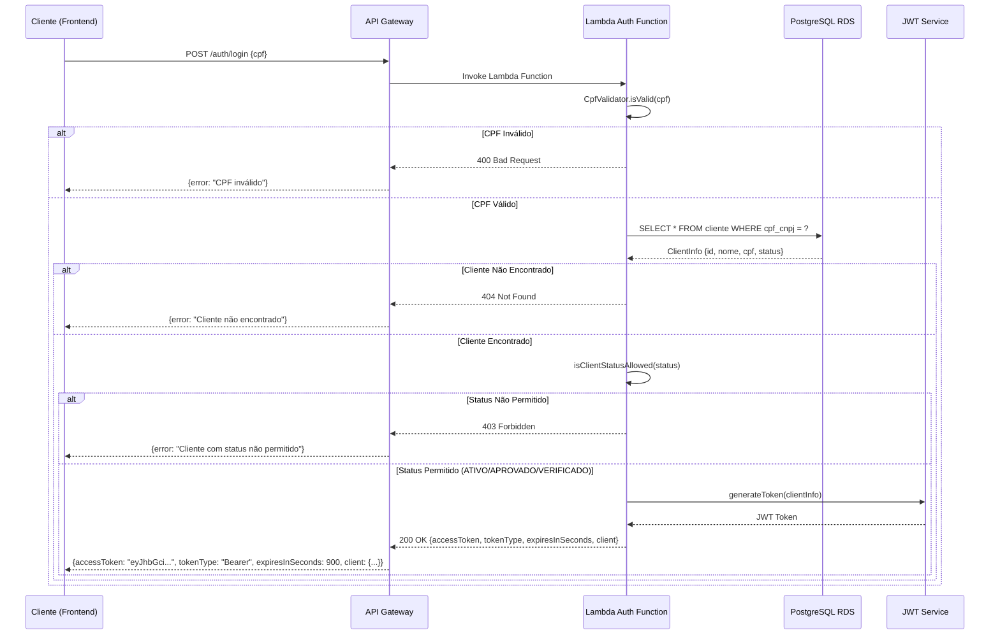
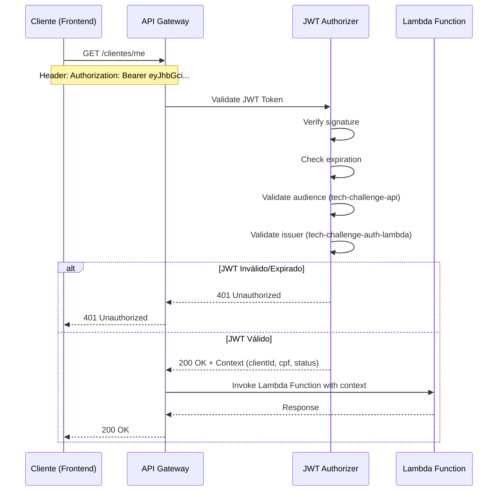

# Diagrama de Sequência - Fluxo de Autenticação

## Visão Geral
Este diagrama ilustra o fluxo completo de autenticação desde o cliente até a geração do token JWT.

## Diagrama de Sequência

## Fluxo de Requisição com JWT em Rotas Protegidas

## Componentes do Fluxo

### 1. Validação de CPF
- **Local**: Lambda Function
- **Responsabilidade**: Validar formato e dígitos verificadores
- **Códigos de erro**: 400 Bad Request

### 2. Consulta de Cliente
- **Local**: PostgreSQL RDS
- **Responsabilidade**: Buscar cliente por CPF
- **Códigos de erro**: 404 Not Found

### 3. Validação de Status
- **Local**: Lambda Function
- **Responsabilidade**: Verificar se status permite autenticação
- **Status permitidos**: ATIVO, APROVADO, VERIFICADO
- **Códigos de erro**: 403 Forbidden

### 4. Geração de JWT
- **Local**: Lambda Function (JwtService)
- **Responsabilidade**: Gerar token assinado
- **Configurações**:
  - Expiração: 15 minutos
  - Issuer: tech-challenge-auth-lambda
  - Audience: tech-challenge-api
  - Claims: clientId, cpf, nome, status

### 5. Proteção de Rotas
- **Local**: API Gateway JWT Authorizer
- **Responsabilidade**: Validar token em cada requisição
- **Validações**: Assinatura, expiração, audience, issuer
- **Códigos de erro**: 401 Unauthorized

## Status HTTP Utilizados

| Código | Descrição | Quando é retornado |
|--------|-----------|-------------------|
| 200 | OK | Autenticação bem-sucedida |
| 400 | Bad Request | CPF inválido |
| 401 | Unauthorized | JWT inválido ou expirado |
| 403 | Forbidden | Cliente com status não permitido |
| 404 | Not Found | Cliente não encontrado |
| 500 | Internal Server Error | Erro interno no servidor |

## Variáveis de Ambiente

| Variável | Descrição | Onde é usada |
|----------|-----------|--------------|
| DB_HOST | Endpoint RDS PostgreSQL | DatabaseService |
| DB_NAME | Nome do banco | DatabaseService |
| DB_USERNAME | Usuário do banco | DatabaseService |
| DB_PASSWORD | Senha do banco | DatabaseService |
| JWT_SECRET | Segredo JWT (Base64) | JwtService |

## Segurança

1. **CPF**: Sempre mascarado em logs e respostas
2. **JWT Secret**: Armazenado em variável de ambiente
3. **Credenciais DB**: Variáveis de ambiente da Lambda
4. **Conexão RDS**: Via VPC privada
5. **IAM Roles**: Permissões mínimas necessárias
