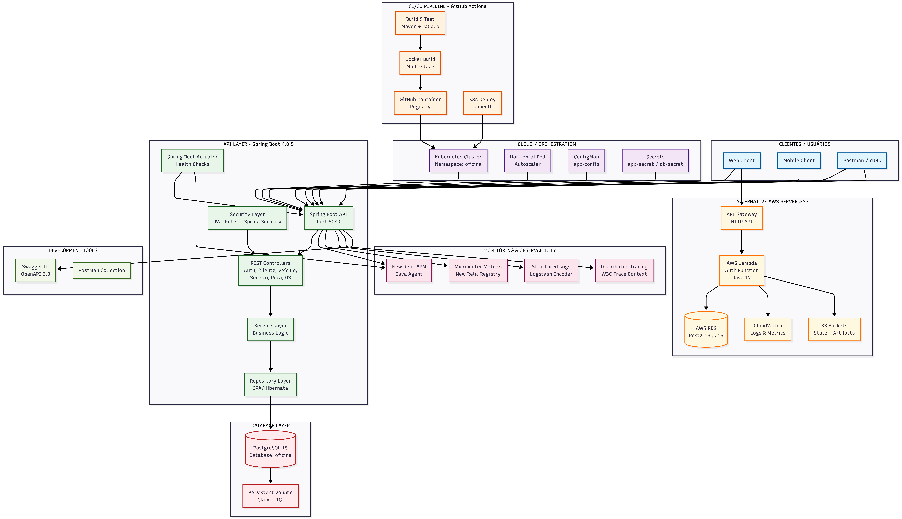

# Diagrama de Componentes - Tech Challenge Mecânica

## Visão Geral

Este diagrama representa a arquitetura completa do sistema de gestão de oficina mecânica, incluindo a visão de nuvem, APIs, banco de dados e monitoramento.

## Diagrama

## Descrição dos Componentes

### Camada de Clientes
- **Web/Mobile Clients**: Aplicações frontend que consomem a API
- **Postman/cURL**: Ferramentas para testes de API

### Pipeline CI/CD
- **Build & Test**: Maven com JaCoCo para cobertura de testes (100% coverage em services)
- **Docker Build**: Multi-stage build com Maven + JRE (Eclipse Temurin 17)
- **GitHub Container Registry**: Armazenamento de imagens Docker (tags SHA e latest)
- **K8s Deploy**: Deploy automatizado via kubectl com manifests do diretório `k8s/`

### Orquestração em Nuvem
- **Kubernetes Cluster**: Cluster K8s (local com Kind/Minikube ou EKS na AWS)
- **HPA**: Horizontal Pod Autoscaler configurado para escalar de 1 a 5 réplicas baseado em CPU (70%) e memória (75%)
- **ConfigMap**: Configurações não sensíveis (Spring profiles, JWT params, log level)
- **Secrets**: Dados sensíveis (JWT secret, credenciais DB, New Relic license key)

### Camada de API
- **Spring Boot API**: Aplicação Java 17, Spring Boot 4.0.5, porta 8080
- **Controllers**: Endpoints REST para:
  - Autenticação (JWT login)
  - Clientes (CRUD com CPF mascarado)
  - Veículos (CRUD com placa mascarada)
  - Serviços (CRUD)
  - Peças (CRUD + controle de estoque)
  - Ordens de Serviço (admin + consulta pública)
- **Service Layer**: Lógica de negócio com Clean Architecture
- **Repository Layer**: JPA/Hibernate para persistência
- **Security Layer**: JWT filter + Spring Security com roles (ADMIN, USER)
- **Actuator**: Health checks para liveness/readiness probes (`/actuator/health`)

### Camada de Banco de Dados
- **PostgreSQL 15**: Banco de dados principal (database: oficina)
- **PVC**: Persistent Volume Claim (1Gi) para persistência dos dados
- **H2 Database**: Banco em memória para testes automatizados

### Monitoramento e Observabilidade
- **New Relic APM**: Java Agent para APM e distributed tracing
- **Micrometer Metrics**: Exportação de métricas para New Relic
- **Structured Logs**: Logstash encoder para logs estruturados em JSON
- **Distributed Tracing**: W3C Trace Context para tracing distribuído
- **Dashboards**: Dashboards e alertas configurados via Terraform em `aws/terraform/newrelic.tf`

### Alternativa AWS Serverless
- **API Gateway**: Gateway HTTP para roteamento de requisições
- **Lambda**: Função serverless Java 17 para autenticação (CPF validation, JWT generation)
- **RDS PostgreSQL**: Banco gerenciado na AWS (db.t3.micro, Free Tier)
- **CloudWatch**: Logs e métricas da AWS
- **S3**: Buckets para Terraform state e Lambda artifacts
- **DynamoDB**: Tabela para locks do Terraform

### Ferramentas de Desenvolvimento
- **Swagger UI**: Documentação OpenAPI 3.0 interativa em `/swagger-ui/index.html`
- **Postman Collection**: Coleção pronta em `TechChallengeMecanica.postman_collection.json`

## Tecnologias

| Categoria | Tecnologia | Versão |
|-----------|------------|--------|
| **Linguagem** | Java | 17 |
| **Framework** | Spring Boot | 4.0.5 |
| **Segurança** | Spring Security + JWT | - |
| **Persistência** | Spring Data JPA + Hibernate | - |
| **Banco de Dados** | PostgreSQL | 15 |
| **Orquestração** | Kubernetes | - |
| **IaC** | Terraform | >= 1.0 |
| **Containerização** | Docker / Docker Compose | - |
| **CI/CD** | GitHub Actions | - |
| **Monitoramento** | New Relic APM | - |
| **Documentação** | SpringDoc OpenAPI | 3.0.2 |
| **Testes** | JUnit 5 + Mockito | - |
| **Cobertura** | JaCoCo | 0.8.14 |

## Recursos Kubernetes

### Aplicação
- **Replicas**: 2 (pode escalar até 5 via HPA)
- **CPU**: 500m request / 1000m limit
- **Memória**: 512Mi request / 1Gi limit
- **Porta**: 8080

### Banco de Dados
- **Replicas**: 1
- **CPU**: 250m request / 500m limit
- **Memória**: 256Mi request / 512Mi limit
- **Storage**: 1Gi PVC
- **Porta**: 5432

## Variáveis de Ambiente Principais

| Variável | Descrição |
|----------|-----------|
| `SPRING_DATASOURCE_URL` | URL de conexão com PostgreSQL |
| `SPRING_DATASOURCE_USERNAME` | Usuário do banco (via Secret) |
| `SPRING_DATASOURCE_PASSWORD` | Senha do banco (via Secret) |
| `JWT_SECRET_BASE64` | Chave secreta JWT (via Secret) |
| `JWT_ACCESS_TOKEN_MINUTES` | Tempo de expiração do token |
| `NEW_RELIC_LICENSE_KEY` | License key New Relic (via Secret) |
| `NEW_RELIC_ENABLED` | Habilita monitoramento New Relic |
| `SECURITY_SEED_ENABLED` | Habilita criação de usuário admin |

