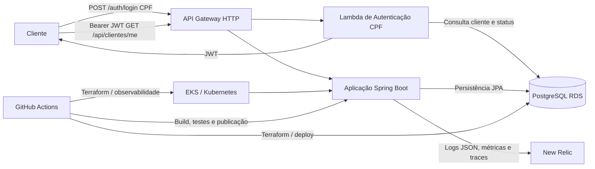

# Diagrama de Componentes — Fase 3

## Visão geral



## Responsabilidade por repositório

| Repositório | Responsabilidade |
|---|---|
| [Aplicação principal](https://github.com/diogocarpio/f1rsters-tech-challenge-mecanica) | API Spring Boot, Dockerfile, JWT, APIs e observabilidade da aplicação |
| [Kubernetes](https://github.com/diogocarpio/f1rsters-tech-challenge-mecanica-terraform-kubernets) | Cluster/recursos Kubernetes e integração de observabilidade |
| [Banco de dados](https://github.com/diogocarpio/f1rsters-tech-challenge-mecanica-terraform-bd) | PostgreSQL RDS, rede, state e pipeline do banco |
| [Lambda](https://github.com/diogocarpio/f1rsters-tech-challenge-mecanica-lambda) | Autenticação CPF, emissão JWT e API Gateway |

## Fluxos principais

### Autenticação

```text
Cliente → API Gateway → Lambda → PostgreSQL RDS
                         ↓
                        JWT
```

### Consumo protegido

```text
Cliente com JWT → API Gateway → Aplicação Kubernetes → PostgreSQL RDS
```

### Observabilidade

```text
Aplicação/Kubernetes → New Relic
```

A publicação efetiva da aplicação e o encaminhamento do Gateway para a aplicação dependem da configuração final dos ambientes e do cluster.
