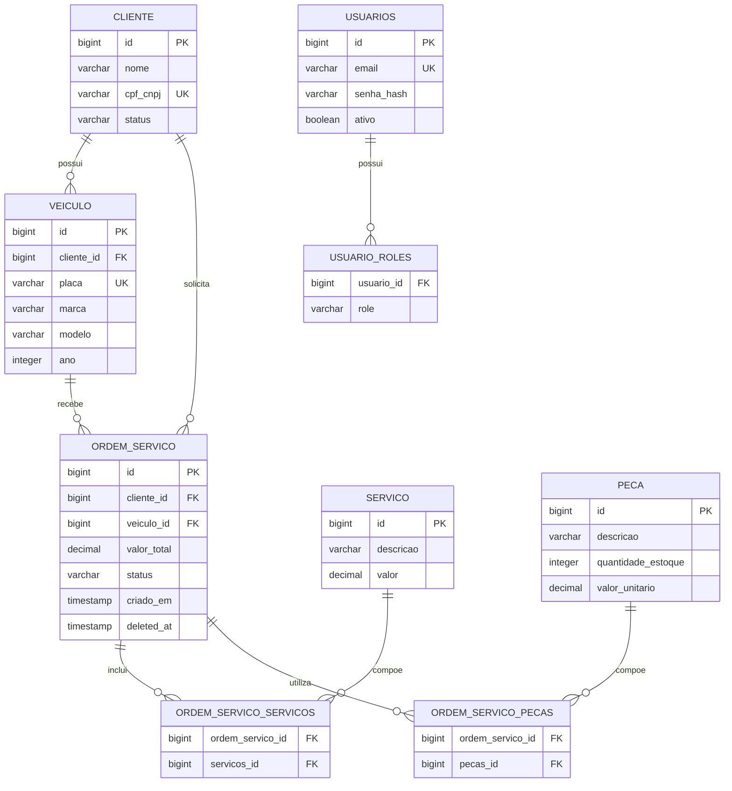

# Banco de Dados e Modelo Relacional

## Escolha do banco de dados

O projeto utiliza PostgreSQL 15 no AWS RDS para os ambientes em nuvem. A escolha preserva a tecnologia já usada pela aplicação Spring Boot e pela Lambda de autenticação, evitando migração de driver, consultas e mapeamentos.

O domínio da oficina é relacional: clientes possuem veículos, ordens de serviço referenciam clientes e veículos, e cada ordem relaciona serviços e peças. PostgreSQL oferece transações, integridade referencial, constraints, índices e consultas relacionais adequadas a esse modelo. O RDS atende ao requisito de banco gerenciado com persistência, backup, criptografia e integração com a infraestrutura AWS existente.

Para desenvolvimento local, o projeto mantém PostgreSQL em Docker Compose. Os testes automatizados utilizam H2 em memória.

## Entidades

| Entidade | Responsabilidade | Identificador |
|---|---|---|
| `Cliente` | Cadastro do proprietário e status usado pela autenticação por CPF | `id` |
| `Veiculo` | Veículo associado a um cliente | `id` |
| `OrdemServico` | Ordem com cliente, veículo, serviços, peças, valor e status | `id` |
| `Servico` | Serviço oferecido pela oficina | `id` |
| `Peca` | Peça e quantidade disponível em estoque | `id` |
| `Usuario` | Usuário interno autenticado por e-mail e senha | `id` |
| `usuario_roles` | Papéis de acesso associados ao usuário interno | `usuario_id`, `role` |

## Diagrama ER



Os nomes das tabelas associativas representam a convenção gerada atualmente pelo Hibernate para os relacionamentos `ManyToMany`. Devem ser confirmados no schema gerado antes da documentação final caso a estratégia de nomenclatura seja alterada.

## Relacionamentos

| Origem | Destino | Cardinalidade | Implementação atual |
|---|---|---|---|
| `Cliente` | `Veiculo` | 1:N | `Cliente.veiculos` e `Veiculo.cliente` |
| `Cliente` | `OrdemServico` | 1:N | FK de cliente na ordem |
| `Veiculo` | `OrdemServico` | 1:N | FK de veículo na ordem |
| `OrdemServico` | `Servico` | N:N | Tabela associativa gerada pelo JPA |
| `OrdemServico` | `Peca` | N:N | Tabela associativa gerada pelo JPA |
| `Usuario` | `Role` | 1:N | `@ElementCollection` em `usuario_roles` |

## Decisões de modelagem

- CPF/CNPJ é normalizado antes da persistência e possui unicidade.
- Placa é normalizada e possui unicidade.
- E-mail de usuário interno é único e obrigatório.
- Senha é armazenada como hash na entidade `Usuario`.
- Status de cliente é persistido como texto com `EnumType.STRING`.
- O status inicial do cliente é `ATIVO`, conforme decisão do grupo.
- `ATIVO`, `APROVADO` e `VERIFICADO` permitem emissão e consumo do JWT de cliente.
- Status da ordem também é persistido como texto, evitando dependência da posição numérica do enum.
- `deleted_at` permite identificar exclusão lógica de ordens no modelo atual.
- Serviços e peças são relacionados à ordem pelas associações N:N já existentes.

## Consistência

As seguintes regras já estão representadas no modelo:

- chaves primárias em todas as entidades;
- unicidade de CPF/CNPJ, placa e e-mail;
- status de cliente obrigatório com valor inicial;
- papéis de usuário armazenados separadamente;
- referências de cliente e veículo na ordem de serviço;
- transação na abertura de ordem e baixa de estoque.

A aplicação deve manter a normalização de CPF/CNPJ e placa antes das consultas e da persistência. A Lambda consulta o cliente pela coluna `cpf_cnpj` e utiliza a coluna `status`, agora representada pela entidade `Cliente`.

## Avaliação de índices

### Índices existentes ou esperados

| Campo | Origem | Finalidade |
|---|---|---|
| Chaves primárias `id` | `@Id` | Busca e relacionamento por identificador |
| `cliente.cpf_cnpj` | Constraint de unicidade | Autenticação e busca de cliente por CPF/CNPJ |
| `veiculo.placa` | Constraint de unicidade | Busca de veículo pela placa |
| `usuarios.email` | Constraint de unicidade | Login dos usuários internos |

No PostgreSQL, constraints `UNIQUE` normalmente criam índices únicos. Não é necessário criar índices duplicados para esses campos.

### Índices a avaliar quando houver volume representativo

| Campo ou conjunto | Consulta relacionada | Situação |
|---|---|---|
| `veiculo.cliente_id` | Listagem de veículos por cliente | Avaliar conforme uso da consulta |
| `ordem_servico.cliente_id` | Ordens de um cliente | Relevante para consultas protegidas futuras |
| `ordem_servico.veiculo_id` | Histórico de ordens do veículo | Avaliar conforme uso da consulta |
| `ordem_servico.status`, `ordem_servico.criado_em` | Fila ordenada de ordens ativas | Avaliar com dados representativos |
| FKs das tabelas associativas | Carregamento de serviços e peças da ordem | Avaliar no schema gerado |

A avaliação não implica criação automática desses índices. A decisão deve considerar as consultas realmente usadas e o volume de dados, pois índices adicionais aumentam o custo de escrita e armazenamento.

## Compatibilidade com a autenticação

A estrutura de cliente oferece os campos necessários para o fluxo serverless:

```sql
SELECT id, nome, cpf_cnpj, status
FROM cliente
WHERE cpf_cnpj = ?;
```

O CPF/CNPJ é único e o status permite decidir se o cliente pode receber um token. A aplicação principal também consulta o cliente pelo CPF presente no JWT na rota protegida `GET /api/clientes/me`.
