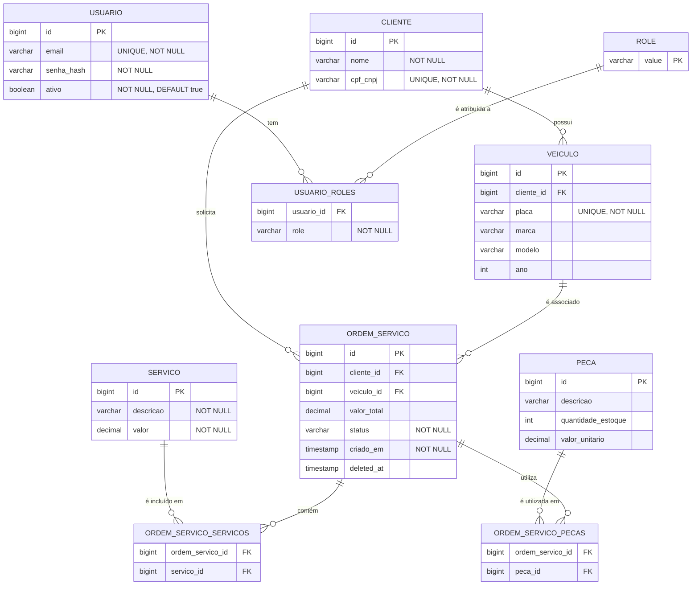

# Diagrama ER - Modelo Relacional do Banco de Dados

## Visão Geral
Este documento apresenta o modelo relacional do banco de dados PostgreSQL da aplicação Tech Challenge Mecânica, incluindo todas as entidades, relacionamentos e justificativas de modelagem.

## Fluxo

## Diagrama ER (Mermaid)

## Descrição das Entidades

### 1. Cliente
**Tabela**: `cliente`

| Coluna | Tipo | Restrições | Descrição |
|--------|------|------------|-----------|
| `id` | BIGINT | PK, AUTO_INCREMENT | Identificador único do cliente |
| `nome` | VARCHAR(255) | NOT NULL | Nome completo do cliente |
| `cpf_cnpj` | VARCHAR(20) | UNIQUE, NOT NULL | CPF ou CNPJ do cliente (usado para autenticação) |

**Justificativa de Modelagem:**
- **CPF/CNPJ como identificador natural**: No domínio de oficina mecânica, CPF/CNPJ é o identificador principal do cliente
- **UNIQUE constraint**: Garante que não existam clientes duplicados com o mesmo CPF/CNPJ
- **Separado de Usuario**: Cliente é uma entidade de domínio, Usuario é para autenticação administrativa

**Índices:**
- PRIMARY KEY: `id`
- UNIQUE INDEX: `cpf_cnpj` (para autenticação rápida)

### 2. Veículo
**Tabela**: `veiculo`

| Coluna | Tipo | Restrições | Descrição |
|--------|------|------------|-----------|
| `id` | BIGINT | PK, AUTO_INCREMENT | Identificador único do veículo |
| `cliente_id` | BIGINT | FK, NOT NULL | Referência ao cliente proprietário |
| `placa` | VARCHAR(10) | UNIQUE, NOT NULL | Placa do veículo (formato BR/Mercosul) |
| `marca` | VARCHAR(100) | Marca do veículo (ex: Toyota, Volkswagen) |
| `modelo` | VARCHAR(100) | Modelo do veículo (ex: Corolla, Gol) |
| `ano` | INT | Ano de fabricação do veículo |

**Justificativa de Modelagem:**
- **Relacionamento N:1 com Cliente**: Um cliente pode ter múltiplos veículos, um veículo pertence a um cliente
- **Placa UNIQUE**: Garante que não existam veículos duplicados com a mesma placa
- **Campos opcionais**: Marca, modelo e ano são informativos, não obrigatórios

**Índices:**
- PRIMARY KEY: `id`
- UNIQUE INDEX: `placa` (para busca rápida por placa)
- INDEX: `cliente_id` (para buscar veículos de um cliente)

### 3. Serviço
**Tabela**: `servico`

| Coluna | Tipo | Restrições | Descrição |
|--------|------|------------|-----------|
| `id` | BIGINT | PK, AUTO_INCREMENT | Identificador único do serviço |
| `descricao` | VARCHAR(255) | NOT NULL | Descrição do serviço (ex: Troca de óleo, Alinhamento) |
| `valor` | DECIMAL(10,2) | NOT NULL | Valor unitário do serviço |

**Justificativa de Modelagem:**
- **Catálogo de serviços**: Tabela de lookup para serviços disponíveis na oficina
- **Valor unitário**: Cada serviço tem um preço base, pode ser ajustado na ordem de serviço
- **Independente de ordem de serviço**: Serviços podem ser reutilizados em múltiplas ordens

**Índices:**
- PRIMARY KEY: `id`
- INDEX: `descricao` (para busca de serviços)

### 4. Peça
**Tabela**: `peca`

| Coluna | Tipo | Restrições | Descrição |
|--------|------|------------|-----------|
| `id` | BIGINT | PK, AUTO_INCREMENT | Identificador único da peça |
| `descricao` | VARCHAR(255) | Descrição da peça (ex: Filtro de óleo, Pastilha de freio) |
| `quantidade_estoque` | INT | Quantidade em estoque |
| `valor_unitario` | DECIMAL(10,2) | Valor unitário da peça |

**Justificativa de Modelagem:**
- **Controle de estoque**: Campo `quantidade_estoque` para gestão de inventário
- **Valor unitário**: Cada peça tem um preço base
- **Independente de ordem de serviço**: Peças podem ser reutilizadas em múltiplas ordens

**Índices:**
- PRIMARY KEY: `id`
- INDEX: `descricao` (para busca de peças)

### 5. Ordem de Serviço
**Tabela**: `ordem_servico`

| Coluna | Tipo | Restrições | Descrição |
|--------|------|------------|-----------|
| `id` | BIGINT | PK, AUTO_INCREMENT | Identificador único da ordem de serviço |
| `cliente_id` | BIGINT | FK, NOT NULL | Referência ao cliente |
| `veiculo_id` | BIGINT | FK, NOT NULL | Referência ao veículo |
| `valor_total` | DECIMAL(10,2) | Valor total da ordem de serviço |
| `status` | VARCHAR(50) | NOT NULL | Status da ordem (RECEBIDA, DIAGNOSTICO, AGUARDANDO_APROVACAO, EM_EXECUCAO, FINALIZADA, ENTREGUE) |
| `criado_em` | TIMESTAMP | NOT NULL | Data/hora de criação da ordem |
| `deleted_at` | TIMESTAMP | Soft delete (null se ativo) |

**Justificativa de Modelagem:**
- **Relacionamento N:1 com Cliente e Veículo**: Uma ordem pertence a um cliente e um veículo
- **Status como enum**: Garante consistência dos status possíveis
- **Soft delete**: Campo `deleted_at` permite recuperação de ordens excluídas
- **Timestamp de criação**: Para métricas de tempo por status

**Índices:**
- PRIMARY KEY: `id`
- INDEX: `cliente_id` (para buscar ordens de um cliente)
- INDEX: `veiculo_id` (para buscar ordens de um veículo)
- INDEX: `status` (para buscar ordens por status)
- INDEX: `criado_em` (para métricas temporais)
- INDEX: `deleted_at` (para soft delete)

### 6. Ordem de Serviço - Serviços (Tabela Associativa)
**Tabela**: `ordem_servico_servicos`

| Coluna | Tipo | Restrições | Descrição |
|--------|------|------------|-----------|
| `ordem_servico_id` | BIGINT | FK, PK | Referência à ordem de serviço |
| `servico_id` | BIGINT | FK, PK | Referência ao serviço |

**Justificativa de Modelagem:**
- **Relacionamento N:N**: Uma ordem pode ter múltiplos serviços, um serviço pode estar em múltiplas ordens
- **Chave composta PK**: Garante que não existam duplicatas da mesma combinação

**Índices:**
- PRIMARY KEY: `(ordem_servico_id, servico_id)`
- INDEX: `servico_id` (para buscar ordens que usam um serviço)

### 7. Ordem de Serviço - Peças (Tabela Associativa)
**Tabela**: `ordem_servico_pecas`

| Coluna | Tipo | Restrições | Descrição |
|--------|------|------------|-----------|
| `ordem_servico_id` | BIGINT | FK, PK | Referência à ordem de serviço |
| `peca_id` | BIGINT | FK, PK | Referência à peça |

**Justificativa de Modelagem:**
- **Relacionamento N:N**: Uma ordem pode ter múltiplas peças, uma peça pode estar em múltiplas ordens
- **Chave composta PK**: Garante que não existam duplicatas da mesma combinação

**Índices:**
- PRIMARY KEY: `(ordem_servico_id, peca_id)`
- INDEX: `peca_id` (para buscar ordens que usam uma peça)

### 8. Usuário
**Tabela**: `usuarios`

| Coluna | Tipo | Restrições | Descrição |
|--------|------|------------|-----------|
| `id` | BIGINT | PK, AUTO_INCREMENT | Identificador único do usuário |
| `email` | VARCHAR(255) | UNIQUE, NOT NULL | Email do usuário (usado para login) |
| `senha_hash` | VARCHAR(255) | NOT NULL | Hash da senha (BCrypt) |
| `ativo` | BOOLEAN | NOT NULL, DEFAULT true | Indica se o usuário está ativo |

**Justificativa de Modelagem:**
- **Separado de Cliente**: Usuario é para autenticação administrativa (funcionários da oficina)
- **Email como identificador**: Padrão para autenticação web
- **Senha hash**: Segurança - senha nunca armazenada em texto plano
- **Campo ativo**: Permite desabilitar usuários sem excluí-los

**Índices:**
- PRIMARY KEY: `id`
- UNIQUE INDEX: `email` (para login rápido)

### 9. Usuário - Roles (Tabela Associativa)
**Tabela**: `usuario_roles`

| Coluna | Tipo | Restrições | Descrição |
|--------|------|------------|-----------|
| `usuario_id` | BIGINT | FK, PK | Referência ao usuário |
| `role` | VARCHAR(50) | NOT NULL, PK | Role do usuário (ADMIN, MECANICO, ATENDENTE) |

**Justificativa de Modelagem:**
- **Relacionamento N:N**: Um usuário pode ter múltiplas roles, uma role pode ter múltiplos usuários
- **Role como VARCHAR**: Flexibilidade para adicionar novas roles sem alterar schema
- **Chave composta PK**: Garante que não existam duplicatas

**Índices:**
- PRIMARY KEY: `(usuario_id, role)`
- INDEX: `role` (para buscar usuários por role)

## Relacionamentos

### Cliente ↔ Veículo
- **Tipo**: 1:N (One-to-Many)
- **Descrição**: Um cliente pode ter múltiplos veículos, um veículo pertence a um cliente
- **FK**: `veiculo.cliente_id` → `cliente.id`
- **Cascade**: Se cliente for excluído, veículos associados são excluídos (ON DELETE CASCADE)

### Cliente ↔ Ordem de Serviço
- **Tipo**: 1:N (One-to-Many)
- **Descrição**: Um cliente pode ter múltiplas ordens de serviço, uma ordem pertence a um cliente
- **FK**: `ordem_servico.cliente_id` → `cliente.id`
- **Cascade**: Se cliente for excluído, ordens associadas são excluídas (ON DELETE CASCADE)

### Veículo ↔ Ordem de Serviço
- **Tipo**: 1:N (One-to-Many)
- **Descrição**: Um veículo pode ter múltiplas ordens de serviço, uma ordem pertence a um veículo
- **FK**: `ordem_servico.veiculo_id` → `veiculo.id`
- **Cascade**: Se veículo for excluído, ordens associadas são excluídas (ON DELETE CASCADE)

### Ordem de Serviço ↔ Serviço
- **Tipo**: N:N (Many-to-Many)
- **Descrição**: Uma ordem pode ter múltiplos serviços, um serviço pode estar em múltiplas ordens
- **Tabela associativa**: `ordem_servico_servicos`
- **FKs**: `ordem_servico_servicos.ordem_servico_id` → `ordem_servico.id`, `ordem_servico_servicos.servico_id` → `servico.id`

### Ordem de Serviço ↔ Peça
- **Tipo**: N:N (Many-to-Many)
- **Descrição**: Uma ordem pode ter múltiplas peças, uma peça pode estar em múltiplas ordens
- **Tabela associativa**: `ordem_servico_pecas`
- **FKs**: `ordem_servico_pecas.ordem_servico_id` → `ordem_servico.id`, `ordem_servico_pecas.peca_id` → `peca.id`

### Usuário ↔ Role
- **Tipo**: N:N (Many-to-Many)
- **Descrição**: Um usuário pode ter múltiplas roles, uma role pode ter múltiplos usuários
- **Tabela associativa**: `usuario_roles`
- **FKs**: `usuario_roles.usuario_id` → `usuarios.id`

## Índices e Performance

### Índices Primários
Todos os índices primários são `BIGINT AUTO_INCREMENT` para:
- Performance em joins
- Espaço eficiente
- Suporte a grandes volumes de dados

### Índices Únicos
- `cliente.cpf_cnpj`: Garantia de unicidade e performance em autenticação
- `veiculo.placa`: Garantia de unicidade e performance em busca por placa
- `usuarios.email`: Garantia de unicidade e performance em login

### Índices de Foreign Key
Todos os foreign keys têm índices automaticamente criados pelo PostgreSQL para:
- Performance em joins
- Integridade referencial

### Índices de Busca
- `ordem_servico.status`: Para filtrar ordens por status (métricas de tempo por status)
- `ordem_servico.criado_em`: Para consultas temporais (volume diário de ordens)
- `ordem_servico.deleted_at`: Para soft delete (excluir registros excluídos de consultas)

## Normalização

O modelo está na **3ª Forma Normal (3NF)**:
- **1NF**: Todos os atributos são atômicos
- **2NF**: Todos os atributos não-chave dependem totalmente da chave primária
- **3NF**: Não há dependências transitivas

## Escalabilidade

### Volume de Dados Estimado
- **Clientes**: ~1.000-10.000 registros
- **Veículos**: ~2.000-20.000 registros (2-3 por cliente)
- **Ordens de Serviço**: ~10.000-100.000 registros/ano
- **Serviços**: ~50-100 registros (catálogo fixo)
- **Peças**: ~100-500 registros (catálogo fixo)
- **Usuários**: ~10-50 registros (funcionários)

### Estratégias de Escalabilidade
- **Partitioning**: Não necessário para volume estimado
- **Sharding**: Não necessário para volume estimado
- **Read Replicas**: Pode ser adicionado no futuro para leituras intensivas
- **Connection Pooling**: Implementado via HikariCP (Spring Boot default)

## Backup e Recuperação

### Estratégia de Backup
- **Automated Backups**: Configurado no RDS (7 dias de retenção)
- **Backup Window**: 03:00-04:00 UTC (horário de baixa atividade)
- **Snapshot Final**: Criado ao deletar instância RDS

### Recuperação
- **Point-in-Time Recovery**: Suportado pelo RDS (até 7 dias)
- **Restore from Snapshot**: Disponível para snapshots manuais e automáticos

## Segurança

### Encryption
- **At Rest**: Habilitado no RDS (AES-256)
- **In Transit**: SSL/TLS obrigatório para conexões

### Access Control
- **VPC Private Subnets**: RDS não acessível publicamente
- **Security Groups**: Restringe acesso a IPs autorizados
- **IAM Roles**: Permissões mínimas necessárias

### Auditoria
- **CloudTrail**: Logs de acessos ao RDS
- **CloudWatch**: Logs de queries lentas

## Migrações

### Estratégia de Migração
- **Hibernate DDL**: `ddl-auto: update` em desenvolvimento
- **Flyway/Liquibase**: Recomendado para produção (não implementado ainda)
- **Versionamento**: Scripts SQL versionados para mudanças de schema

