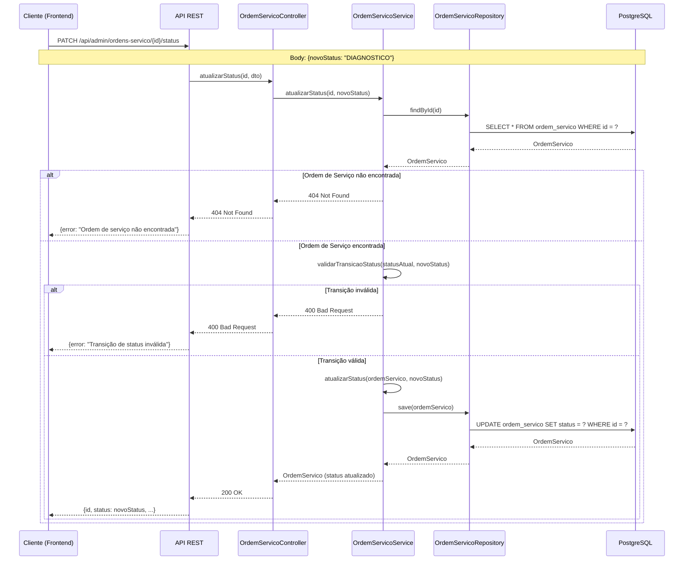
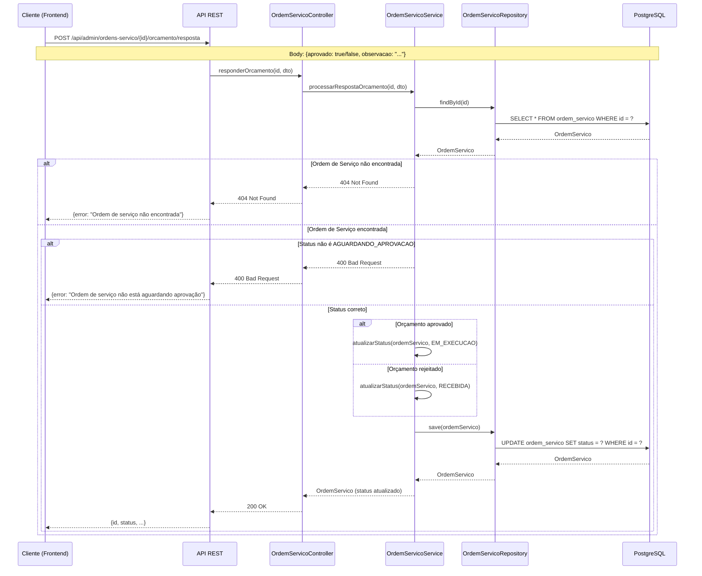
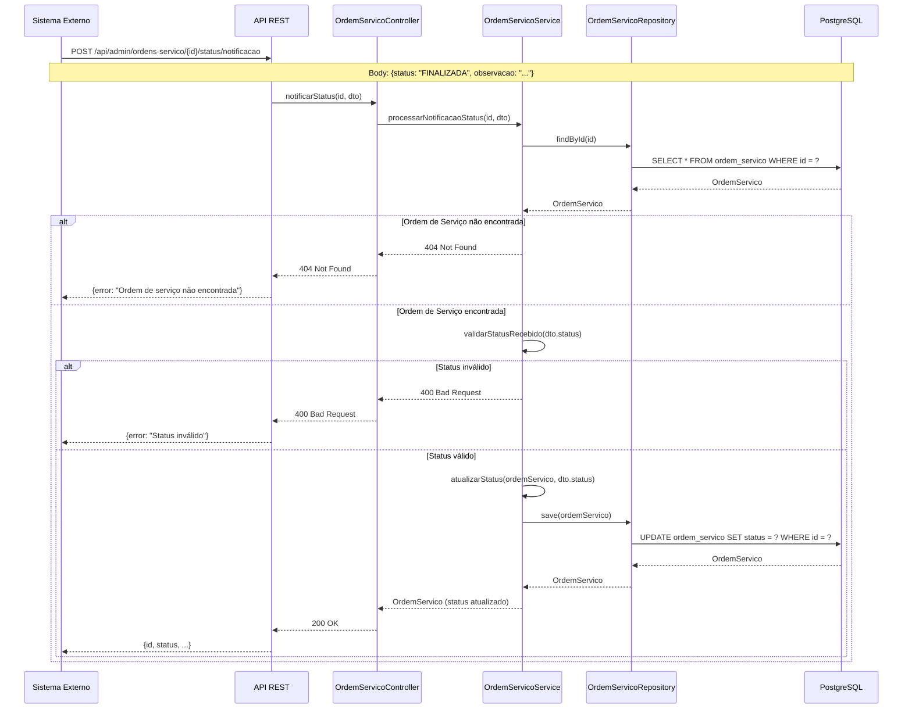

# Diagrama de Sequência - Abertura de Ordem de Serviço

## Visão Geral
Este diagrama ilustra o fluxo completo de abertura de uma ordem de serviço, desde a requisição inicial até a finalização.

## Diagrama de Sequência


## Fluxo de Atualização de Status



## Fluxo de Resposta de Orçamento



## Fluxo de Notificação de Status (Integração Externa)



## Estados da Ordem de Serviço

### Status Possíveis

| Status | Descrição | Próximos Status Possíveis |
|--------|-----------|---------------------------|
| **RECEBIDA** | Ordem de serviço criada, aguardando diagnóstico | DIAGNOSTICO |
| **DIAGNOSTICO** | Veículo em diagnóstico | AGUARDANDO_APROVACAO |
| **AGUARDANDO_APROVACAO** | Orçamento gerado, aguardando aprovação do cliente | EM_EXECUCAO (aprovado), RECEBIDA (rejeitado) |
| **EM_EXECUCAO** | Serviços sendo executados | FINALIZADA |
| **FINALIZADA** | Serviços concluídos, aguardando entrega | ENTREGUE |
| **ENTREGUE** | Veículo entregue ao cliente | - |

### Regras de Transição

1. **RECEBIDA → DIAGNOSTICO**: Início do processo de diagnóstico
2. **DIAGNOSTICO → AGUARDANDO_APROVACAO**: Diagnóstico concluído, orçamento gerado
3. **AGUARDANDO_APROVACAO → EM_EXECUCAO**: Cliente aprovou o orçamento
4. **AGUARDANDO_APROVACAO → RECEBIDA**: Cliente rejeitou o orçamento (retrabalho)
5. **EM_EXECUCAO → FINALIZADA**: Serviços concluídos
6. **FINALIZADA → ENTREGUE**: Veículo entregue ao cliente

## Endpoints da API

### Criar Ordem de Serviço
```
POST /api/admin/ordens-servico
Content-Type: application/json

Request:
{
  "clienteId": 1,
  "veiculoId": 1,
  "servicosIds": [1, 2, 3],
  "pecasIds": [1, 2]
}

Response (200 OK):
{
  "id": 123,
  "cliente": {...},
  "veiculo": {...},
  "servicos": [...],
  "pecas": [...],
  "valorTotal": 1500.00,
  "status": "RECEBIDA",
  "criadoEm": "2026-09-14T10:00:00"
}
```

### Atualizar Status
```
PATCH /api/admin/ordens-servico/{id}/status
Content-Type: application/json

Request:
{
  "novoStatus": "DIAGNOSTICO"
}

Response (200 OK):
{
  "id": 123,
  "status": "DIAGNOSTICO",
  ...
}
```

### Responder Orçamento
```
POST /api/admin/ordens-servico/{id}/orcamento/resposta
Content-Type: application/json

Request:
{
  "aprovado": true,
  "observacao": "Orçamento aprovado"
}

Response (200 OK):
{
  "id": 123,
  "status": "EM_EXECUCAO",
  ...
}
```

### Notificar Status (Integração Externa)
```
POST /api/admin/ordens-servico/{id}/status/notificacao
Content-Type: application/json

Request:
{
  "status": "FINALIZADA",
  "observacao": "Serviços concluídos com sucesso"
}

Response (200 OK):
{
  "id": 123,
  "status": "FINALIZADA",
  ...
}
```

## Métricas Coletadas

As seguintes métricas são coletadas pelo New Relic para monitoramento:

- **Volume diário de ordens de serviço**: `ordem_servico.created.total`
- **Tempo médio por status**: `ordem_servico.status.lead_time.seconds`
- **Falhas de processamento**: `ordem_servico.processing.failure.total`

## Integrações

### Integração Externa para Notificação de Status
- **Endpoint**: `POST /api/admin/ordens-servico/{id}/status/notificacao`
- **Propósito**: Sistema externo notifica mudanças de status (ex: sistema de pagamento, sistema de estoque)
- **Autenticação**: Requer autenticação JWT com role ADMIN
- **Validação**: Status recebido deve ser válido para o contexto atual

## Segurança

- Todos os endpoints requerem autenticação JWT
- Role ADMIN necessária para criar e atualizar ordens de serviço
- Consulta pública de status disponível via endpoint público (sem autenticação)
- Logs estruturados em JSON com correlation ID para rastreamento
