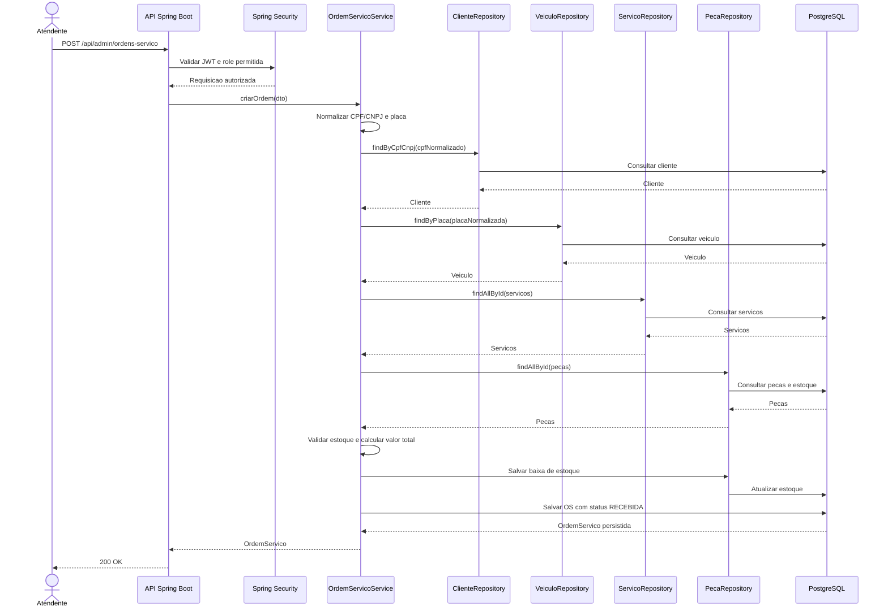

# Diagrama de Sequência — Abertura de Ordem de Serviço

## Fluxo principal

## Regras representadas

- A rota exige autenticação e autorização conforme as regras administrativas atuais.
- CPF/CNPJ e placa são normalizados antes das consultas.
- Cliente, veículo, serviços e peças são buscados antes da criação da ordem.
- A abertura é transacional no serviço.
- Cada peça informada sofre baixa de uma unidade conforme a regra atual.
- A ordem é criada inicialmente com status `RECEBIDA`.

## Principais falhas

- Cliente inexistente: erro de negócio.
- Veículo inexistente: erro de negócio.
- Peça sem estoque: erro de negócio e a transação não deve concluir a abertura.
- Dados inválidos: erro de validação antes do processamento do serviço.
